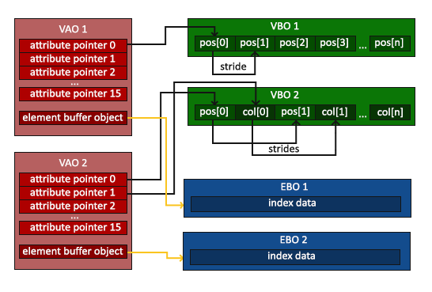

# 图形管线（Graphics Pipeline）

图形管线就是将顶点（*Vertex*）数据转化为 framebuffer 中的 2D 像素结果的流程，其步骤是确定的（有一些步骤可省略），其中的一些步骤可以编程控制，这些运行于 GPU 的自定义程序叫 *Shader*，对应的编程语言叫 *GLSL*（OpenGL Shading Language）。


顶点 Vertex 指的是一个 3D 坐标相关的所有数据的集合，并不只是 3D 坐标，还包括顶点颜色、纹理坐标等其它数据，这些数据都被视为顶点属性（*Vertex Attribute*）。

> 为了让 OpenGL 知道如何处理顶点数据，OpenGL 需要知道使用数据形成哪种图元（*primitive*），比如点、线或者三角形，这些信息在调用绘制命令时提供给 OpenGL。其中一些提示是 GL_POINTS、GL_TRIANGLES 和 GL_LINE_STRIP。

## 图形管线基本流程

### 顶点着色器（*Vertex Shader*）

顶点着色器主要是*对顶点数据中的坐标进行转换*，也允许对其它顶点属性进行一些操作。

### 几何着色器（*Geometry Shader*）

Geometry Shader 是 Pipeline 中可选的一步，若其存在，其输入通常是 Vertex Shader 输出后组成的图元，作用是*基于输入图元生成零个或多个新的图元*。

### 图元组装（*Primitive Assembly*）

图元组装阶段将 Vertex Shader 或 Geometry Shader 输出的*顶点数据组装成图元*。

### 光栅化（*Rasterization*）

光栅化阶段把已经装配好的几何图元，比如三角形，转换成屏幕上的一批 *fragment*。也就是*从三角形这种连续几何形状，变成屏幕上哪些像素位置可能被它覆盖*。

> *Fragment* 就是渲染单个像素所需的所有数据，相当于*候选像素*。
> Fragment 不一定最终成为 framebuffer 中的 pixel，因为它还可能被深度测试、模板测试、裁剪、混合等后续阶段影响或丢弃。

### 片段着色器（*Fragment Shader*）

片段着色器*为光栅化产生的每个 fragment 计算输出结果，最常见的是计算颜色*，许多与最终颜色相关的高级效果会在这个阶段计算，例如光照、纹理采样、阴影相关计算等。

### 模板测试（*Stencil Test*）、深度测试（*Depth Test*）和混合（*Blending*）

检查 fragment 的深度值和模板值决定其是否应该显示，对于都要显示的像素，通过 alpha 混合产生混合颜色。

> OpenGL 要求至少提供 Vertex Shader 和 Fragment Shader。

> 一般 Vertex Shader 写入 gl_Position 的是裁剪空间坐标，OpenGL 会在后续阶段进行裁剪和透视除法，将其转换到 标准设备坐标（*Normalized Device Coordinates*，*NDC*）。NDC 中 X、Y、Z 位于 [-1, 1] 范围内的部分才处于可见范围。与通常的屏幕坐标不同，NDC Y 轴正方向向上，(0,0) 坐标位于中心，而不是左上角。
> NDC 坐标最终会通过 viewport 变换映射到窗口 framebuffer 的像素坐标，glViewport(x, y, width, height) 决定这个映射区域。

## Shader 编程

Shader 编程的基本步骤：
1. 创建指定类型的 Shader 对象
    `GLuint glCreateShader(GLenum type)`
2. 设置 Shader 源码
    `void glShaderSource(GLuint shader, GLsizei count, const GLchar *const*string, const GLint *length)`
3. 编译 Shader
    `void glCompileShader(GLuint shader)`
4. 检查编译结果
    1. `void glGetShaderiv(GLuint shader, GLenum pname, GLint *params)`
    2. `void glGetShaderInfoLog(GLuint shader, GLsizei bufSize, GLsizei *length, GLchar *infoLog)`
5. 创建 Shader Program
    `GLuint glCreateProgram(void)`
6. 添加 Shader 到 Program
    `void glAttachShader(GLuint program, GLuint shader)`
7. 链接 Program
    `void glLinkProgram(GLuint program)`
8. 检查链接结果
    1. `void glGetProgramiv(GLuint program, GLenum pname, GLint *params)`
    2. `void glGetProgramInfoLog(GLuint program, GLsizei bufSize, GLsizei *length, GLchar *infoLog)`
9. 链接 Program 后，Shader 可删除
    `void glDeleteShader(GLuint shader)`
10. 使用 Program（当前使用的 Shader Program 可以切换，切换后，后续绘制命令会使用当前 Program）
    `void glUseProgram(GLuint program)`

Vertex Shader 示例：

```cpp
const char* vertexShaderSource =R"(
// 使用 GLSL 3.3（对应 OpenGL 3.3，需要 3.3 及更高版本 OpenGL 支持），Core Profile
#version 330 core

// layout (location = 0) 表示此 attribute 对应编号为 0，程序绑定数据时需对应编号
// in 表示声明一个 vertex attribute 输入
// vec[1-4] 表示[1-4]维向量
layout (location = 0) in vec3 aPos;

void main()
{
    // gl_Position 是 Vertex Shader 预设的输出变量，无需主动声明
    // 当 Vertex Shader 的 main() 退出时，gl_Position 的值即 Vertex Shader 的输出值
    // 其类型应为 vec4，第四维是齐次坐标的 w 分量
    gl_Position = vec4(aPos.x, aPos.y, aPos.z, 1.0);
}
)";
unsigned int vertexShader = glCreateShader(GL_VERTEX_SHADER);
glShaderSource(vertexShader, 1, &vertexShaderSource, NULL);
glCompileShader(vertexShader);

int success;
glGetShaderiv(vertexShader, GL_COMPILE_STATUS, &success);
if (!success) {
    char infoLog[512];
    glGetShaderInfoLog(vertexShader, 512, NULL, infoLog);
    std::cout << "ERROR::SHADER::VERTEX::COMPILE\n" << infoLog << std::endl;
}
```

Fragment Shader 示例：

```cpp
const char* fragmentShaderSource = R"(
#version 330 core

// 因为 Fragment Shader 可以输出到 framebuffer 的多个 color attachment
// 所以输出变量需要用户自己声明；如果有多个输出，通常需要用 layout(location = n) 指定对应位置。
out vec4 FragColor;

void main()
{
    // 颜色为 RGBA 格式
    FragColor = vec4(1.0f, 0.5f, 0.2f, 1.0f);
}
)";
unsigned int fragmentShader = glCreateShader(GL_FRAGMENT_SHADER);
glShaderSource(fragmentShader, 1, &fragmentShaderSource, NULL);
glCompileShader(fragmentShader);

int success;
glGetShaderiv(fragmentShader, GL_COMPILE_STATUS, &success);
if (!success) {
    char infoLog[512];
    glGetShaderInfoLog(fragmentShader, 512, NULL, infoLog);
    std::cout << "ERROR::SHADER::FRAGMENT::COMPILE\n" << infoLog << std::endl;
}
```

## 顶点数据绑定（VBO、VAO、EBO）



要为图形管线，或者说 Vertex Shader 提供顶点数据，需要将顶点数据存储于指定的对象中，OpenGL 的顶点数据存于 *Vertex Buffer Object*（VBO）。

OpenGL 绘制时通过当前绑定的 *Vertex Array Object*（VAO）对象获取*如何解释和访问顶点数据*的状态，Core Profile 中，绘制前必须绑定有效 VAO，否则顶点属性状态没有载体。*关于 VBO、EBO 与顶点属性配置相关的一些操作，需要在已经绑定 VAO 的情况下进行*。

*Element Buffer Object*（EBO）提供基于索引访问顶点数据的方法，可以实现顶点的重复使用，比如一个矩形，拆分成 2 个三角形后，逻辑上有 6 个顶点（一个顶点数据至少 3 个浮点数坐标）进行处理，但实际上只需要 4 个顶点数据 + 6 个索引即可。

VBO、VAO、EBO 基本使用流程：

1. 创建 VBO、VAO、EBO
```cpp
unsigned int VAO, VBO, EBO;
glGenVertexArrays(1, &VAO);
glGenBuffers(1, &VBO);
glGenBuffers(1, &EBO);
```

2. 绑定 VAO
```cpp
glBindVertexArray(VAO);
```

3. 绑定 VBO，设置 VBO 数据
```cpp
float vertices[] = {
    -0.6f, -0.0f, 0.0f,
    -0.1f, -0.5f, 0.0f,
    -0.1f, 0.5f, 0.0f
};
glBindBuffer(GL_ARRAY_BUFFER, VBO);
glBufferData(GL_ARRAY_BUFFER, sizeof(vertices), vertices, GL_STATIC_DRAW);
```

4. 配置 VAO 中某个 vertex attribute 的读取规则，并记录该 attribute 从当前绑定的 VBO 中取数据（**从而与 Vertex Shader 的 in attribute 对应**）
```cpp
glVertexAttribPointer(
    0,                  // attribute index / location
    3,                  // 每个 attribute 由 3 个分量组成
    GL_FLOAT,           // 每个分量类型
    GL_FALSE,           // 是否归一化
    3 * sizeof(float),  // stride: 相邻两个顶点的同类 attribute 起点之间的字节距离
    (void*)0            // offset in buffer
);
glEnableVertexAttribArray(0);
```


5. 绑定 EBO，设置 EBO 数据
```cpp
unsigned int indices[] = { 0, 1, 2 };
glBindBuffer(GL_ELEMENT_ARRAY_BUFFER, EBO);
glBufferData(GL_ELEMENT_ARRAY_BUFFER, indicesSize, indices, GL_STATIC_DRAW);
```

6. 需要绘制时，绑定需要绘制的 VAO，然后调用绘制命令：
```cpp
// 如果要使用指定的 Shader Program
// glUseProgram(prog);
glBindVertexArray(VAO);
// 根据当前 VAO 记录的 EBO 绘制，count=3 表示读取 3 个索引，最后一个参数 0 表示从 EBO 的 0 字节偏移处开始读
// 注意：第四个参数类型是 const void*；在绑定 EBO 时，它表示 EBO 内的字节偏移，因此非 0 偏移通常写成 (void*)(offsetBytes)。
glDrawElements(GL_TRIANGLES, 3, GL_UNSIGNED_INT, 0);
// 如果要根据 VAO 的 Vertex Attribute Pointer 进行绘制，从第 0 个顶点开始，绘制 3 个顶点组成的三角形
// glDrawArrays(GL_TRIANGLES, 0, 3);
```

VBO、VAO、EBO 的解除绑定的方式都是将 ID 为 0 的对象设为当前绑定对象：

```cpp
glBindVertexArray(0);
glBindBuffer(GL_ARRAY_BUFFER, 0);
glBindBuffer(GL_ELEMENT_ARRAY_BUFFER, 0);
```

> 注意！！对于 EBO，VAO 记录的是 EBO 的绑定与解绑操作，因此 EBO 的绑定必须发生在 VAO 绑定期间，且直到 VAO 解绑前，EBO 必须保持绑定状态，若解绑 EBO，则 VAO 会记录为未绑定 EBO。
> VBO 无此要求，因为 VAO 是在 `glVertexAttribPointer()` 调用时，把当时绑定到 `GL_ARRAY_BUFFER` 的 VBO 记录进该 attribute 的配置里，VAO 通过内部存储的 attribute 指针访问顶点数据。但一般建议 VBO 和 EBO 采用类似操作模式，即 VAO 已绑定情况下，设置 VBO 和 EBO。

当资源不再需要时，释放/删除的方法：

```cpp
glDeleteVertexArrays(1, &VAO);
glDeleteBuffers(1, &VBO);
glDeleteBuffers(1, &EBO);
```

相关 API：
- `void glGenBuffers(GLsizei n, GLuint *buffers)`
- `void glBindBuffer(GLenum target, GLuint buffer)`
- `void glBufferData(GLenum target, GLsizeiptr size, const void *data, GLenum usage)`
- `void glDeleteBuffers(GLsizei n, const GLuint *buffers)`
- `void glGenVertexArrays(GLsizei n, GLuint *arrays)`
- `void glBindVertexArray(GLuint array)`
- `void glVertexAttribPointer(GLuint index, GLint size, GLenum type, GLboolean normalized, GLsizei stride, const void *pointer)`
- `void glEnableVertexAttribArray(GLuint index)`
- `void glDeleteVertexArrays(GLsizei n, const GLuint *arrays)`