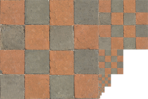

# Texture

在最常见的用法中，纹理（*Texture*）可以被理解为“贴在模型/面片表面的图像”，但其本质上是可被 GPU 采样的任意数据，图像只是其常见形式，还有诸如凹凸高度信息、深度信息等其它数据。

> 采样：Shader 根据纹理坐标，从纹理中取出当前 fragment 所需纹理数据的过程。

## 纹理坐标系

OpenGL 将 (0,0) 对应纹理左下角，(1,1) 对应纹理右上角，且由于 XYZ 被用于空间坐标系，所以纹理坐标系采用 STR 的叫法。

很多图片文件/图像库按“左上角为原点、从上到下”的顺序提供像素数据，而 OpenGL 纹理坐标通常把 `(0,0)` 视为纹理左下角。因此，如果直接上传这类图像数据，贴图在视觉上可能上下颠倒，所以加载图像数据时通常要做垂直翻转（如果是 stb_image.h 库，则通过 `stbi_set_flip_vertically_on_load(true)` 设置加载行为）。

## Texture Wrapping

*Texture Wrapping* 指的是当纹理坐标超出 [0, 1] 范围时的采样行为：

- GL_REPEAT: 默认行为，重复纹理图像。
- GL_MIRRORED_REPEAT: 和 GL_REPEAT 一样，重复纹理，但是每次重复都会进行镜像操作。
- GL_CLAMP_TO_EDGE: 把纹理坐标钳制在 [0, 1] 范围内，更大的坐标值会被固定到纹理边缘，最终表现为边缘像素向外拉伸的效果。
- GL_CLAMP_TO_BORDER: 对于超出 [0, 1] 范围的纹理坐标，采样结果会使用用户指定的边框颜色。


设置 Texture Wrapping 的方法：

```cpp
// 注意，水平方向和垂直方向是分别设置
glTexParameteri(GL_TEXTURE_2D, GL_TEXTURE_WRAP_S, GL_MIRRORED_REPEAT);
glTexParameteri(GL_TEXTURE_2D, GL_TEXTURE_WRAP_T, GL_MIRRORED_REPEAT);
```

## Texture Filtering（纹理过滤）

纹理坐标可以是任意浮点数，而纹理的尺寸是有限的，所以采样时纹理坐标通常不能对应到一个确切的纹理像素（*Texel*），如何采用、决定最终的片段颜色，就是 *Texture  Filtering*。

Texture Filtering 的方法有两种，*GL_NEAREST* 和 *GL_LINEAR*：

1. GL_NEAREST：最近邻点（*nearest neighbor*）或点过滤（*point filtering*），这是 OpenGL 的默认方法。OpenGL 选择*中心采样点*离纹理坐标最近的 texel 作为 fragment 颜色。

    > 中心采样点：每个 texel 相当于纹理图像中的一个小格子/小区域，中心采样点，就是这个小格子的中心位置，第 i 个 texel 的中心采样点就是：((i + 0.5) / W, (j + 0.5) / H)。

    
    
2. GL_LINEAR：双线性过滤（*bilinear filtering*，双指的是水平+垂直），根据纹理坐标周围的几个 texel，按距离做加权混合，得到一个混合颜色作为 fragment 颜色。

    

设置纹理过滤的方法：

```cpp
// 注意，纹理放大（magnification）和纹理缩小（minification）分别设置
glTexParameteri(GL_TEXTURE_2D, GL_TEXTURE_MIN_FILTER, GL_NEAREST);
glTexParameteri(GL_TEXTURE_2D, GL_TEXTURE_MAG_FILTER, GL_LINEAR);
```

## Mipmap（多级纹理/纹理金字塔）

如果模型距离相机很远，出现纹理缩小时，一个屏幕像素会对应多个 texel，可能出现闪烁、摩尔纹等问题。为了解决纹理缩小时遇到的问题，需要使用合理的、缩小过的纹理尺寸，而不是一股脑使用原始尺寸，因此引入了 *Mipmap*，就是一张纹理图片的多级缩略图组成的序列，其中每一级图像是上一级图像的一半大（宽高都减半）。当模型距离相机的距离达到一定值时，OpenGL 会使用 mipmap 中尺寸更合理的纹理图像。



> 一个完整的 mipmap （最后一级的尺寸是 1x1）内存使用大约是原始尺寸的 4/3（根据等比数列公式推算），内存占用会更多，但是没有多出太多，而当使用小纹理时，还可以优化缓存命中、减小带宽压力。

> OpenGL 通过观察相邻 fragment 之间的纹理坐标的变化率来决定使用哪一级纹理。比如水平方向相邻两个屏幕像素：  
> fragment A: TexCoord = (0.10, 0.20)  
> fragment B: TexCoord = (0.11, 0.20)  
> s 方向变化了：0.01，如果纹理宽度是 1024，那么这个变化对应原纹理中的：  
> 0.01 × 1024 = 10.24 个 texel  
> 也就是说，屏幕上横向移动 1 个像素，纹理坐标已经跨过了大约 10 个 texel。

我们可以手动设置 mipmap 的每一级图像（`glTexImage2D()`的第二个参数），也可以通过 `glGenerateMipmap(GL_TEXTURE_2D)` 让 OpenGL 根据当前 active texture unit 上绑定到 `GL_TEXTURE_2D` 目标的纹理对象，自动生成其余 mipmap 层级。

与纹理过滤类似，mipmap 的两个相邻级别也可以选择 NEAREST 或 LINEAR 过滤：

- `GL_NEAREST_MIPMAP_NEAREST`：选择与像素大小最接近的 mipmap 层级，并在该层级内使用最近邻采样。
- `GL_LINEAR_MIPMAP_NEAREST`：选择与像素大小最接近的 mipmap 层级，并在该层级内使用线性采样。
- `GL_NEAREST_MIPMAP_LINEAR`：选择最接近的两个 mipmap 层级，分别在两个层级内使用最近邻采样，然后对两个采样结果进行线性插值。
- `GL_LINEAR_MIPMAP_LINEAR`：选择最接近的两个 mipmap 层级，分别在两个层级内使用线性采样，然后对两个采样结果进行线性插值。

设置方法与设置 Texture Filtering 一样：

```cpp
glTexParameteri(GL_TEXTURE_2D, GL_TEXTURE_MIN_FILTER, GL_LINEAR_MIPMAP_LINEAR);
glTexParameteri(GL_TEXTURE_2D, GL_TEXTURE_MAG_FILTER, GL_LINEAR);
```

需要注意的是，mipmap 相关的这些枚举值，仅可用于纹理缩小，即 `GL_TEXTURE_MIN_FILTER`。

# 纹理加载与创建

VBO 绑定到的是“全局当前上下文里的某个 buffer target”，比如 GL_ARRAY_BUFFER。
纹理绑定到的是“当前 active texture unit 里的某个 texture target”，比如 GL_TEXTURE_2D。

加载纹理、创建纹理对象的基本流程：

1. 准备图像数据
2. 生成纹理对象
3. 设置当前 *Texture Unit*（可选，默认当前为 0）
4. 绑定纹理对象至当前 Texture Unit 的某个 Target（如 GL_TEXTURE_2D）
5. 通过 Target 修改当前绑定的纹理对象属性，如图像数据、Texture Wrapping Mode、Texture Filtering Method等。（*在未使用独立 sampler object 的常见写法中，wrap/filter/mipmap 等采样参数通常存储在 texture object 中*）

使用纹理对象的方法：

1. Shader 中定义一个 *sampler* （Uniform）变量来访问纹理（Texture Unit），有 `sampler1D`、 `sampler2D`、 `sampler3D`，取决于纹理类型。
2. 程序通过 `glUniform1i` 设置 sampler 变量对应的 texture unit
3. Shader 中通过 `texture(sampler, texCoord)` 从 texture unit 中进行采样

> `Texture Unit` 可以粗略类比为纹理系统中的 `Vertex Attribute Index`：二者都是 Shader 访问外部资源时使用的编号入口。  
> 顶点属性通过 `layout(location = N)` 和 `glVertexAttribPointer()` 建立 Shader 输入与 VAO/VBO 数据之间的连接；纹理采样则通过 `glUniform1i()` 让 Shader 中的 `sampler` 指向某个 Texture Unit，再通过 `glActiveTexture()` / `glBindTexture()` 把具体纹理对象绑定到该 Unit 的纹理目标上。
> 纹理访问链路是：`sampler uniform -> texture unit -> texture target -> texture object`

## 纹理图像加载

可以通过第三方 Header-Only 库 stb_image.h 完成图像的加载，该头文件需要有至少一个源文件包含并定义 `STB_IMAGE_IMPLEMENTATION` 宏，此宏会使头文件中的函数实现可见：

```cpp
#define STB_IMAGE_IMPLEMENTATION
#include "stb_image.h"
```

加载图像的方法：

```cpp
// 注意纹理的坐标系和图像数据的内存布局不匹配，需要垂直翻转
stbi_set_flip_vertically_on_load(true);
int width, height, nrChannels;
unsigned char *data = stbi_load("container.jpg", &width, &height, &nrChannels, 0);
```

> 图像数据被加载到纹理对象后，需要释放 `stbi_load()` 返回的 buffer：`stbi_image_free(data)`。

## 纹理对象创建与数据设置

```cpp
unsigned int texture;
// 1. 生成纹理对象，ID 写入 texture
glGenTextures(1, &texture);
// 2. 激活纹理单元 0（绑定前须先激活目标 Texture Unit，默认当前为 0 时可省略）
glActiveTexture(GL_TEXTURE0);
// 3. 将纹理对象绑定到当前 Texture Unit 的 GL_TEXTURE_2D 目标
glBindTexture(GL_TEXTURE_2D, texture);
// 4. 设置环绕方式：S/T 分别对应水平、垂直方向（作用于当前绑定的纹理对象）
glTexParameteri(GL_TEXTURE_2D, GL_TEXTURE_WRAP_S, GL_REPEAT);	
glTexParameteri(GL_TEXTURE_2D, GL_TEXTURE_WRAP_T, GL_REPEAT);
// 5. 设置纹理过滤：缩小用三线性 mipmap 采样，放大用线性（mipmap 相关枚举仅用于 GL_TEXTURE_MIN_FILTER）
glTexParameteri(GL_TEXTURE_2D, GL_TEXTURE_MIN_FILTER, GL_LINEAR_MIPMAP_LINEAR);
glTexParameteri(GL_TEXTURE_2D, GL_TEXTURE_MAG_FILTER, GL_LINEAR);
// 6. 上传第 0 级 mipmap 图像数据（level=0；内部格式/像素格式需与 stbi_load 的 nrChannels 匹配，这里假设加载的是 3 通道 RGB 图像；如果通道数为 4，通常应使用 GL_RGBA）。
glTexImage2D(GL_TEXTURE_2D, 0, GL_RGB, width, height, 0, GL_RGB, GL_UNSIGNED_BYTE, data);
// 7. 由 OpenGL 自动生成其余各级 mipmap（依赖上一步已上传的 level 0 数据）
glGenerateMipmap(GL_TEXTURE_2D);
```

## 纹理坐标设置及 Vertex Shader 代码


```cpp
float vertices[] = {
    // positions          // colors           // texture coords
     0.5f,  0.5f, 0.0f,   1.0f, 0.0f, 0.0f,   1.0f, 1.0f,   // top right
     0.5f, -0.5f, 0.0f,   0.0f, 1.0f, 0.0f,   1.0f, 0.0f,   // bottom right
    -0.5f, -0.5f, 0.0f,   0.0f, 0.0f, 1.0f,   0.0f, 0.0f,   // bottom left
    -0.5f,  0.5f, 0.0f,   1.0f, 1.0f, 0.0f,   0.0f, 1.0f    // top left 
};
glVertexAttribPointer(2, 2, GL_FLOAT, GL_FALSE, 8 * sizeof(float), (void*)(6 * sizeof(float)));
glEnableVertexAttribArray(2);  
```

```glsl
#version 330 core
layout (location = 0) in vec3 aPos;
layout (location = 1) in vec3 aColor;
layout (location = 2) in vec2 aTexCoord;

out vec3 ourColor;
out vec2 TexCoord;

void main()
{
    gl_Position = vec4(aPos, 1.0);
    ourColor = aColor;
    TexCoord = aTexCoord;
}
```

## Fragment Shader 代码

```glsl
#version 330 core

out vec4 FragColor;

in vec2 TexCoord;

uniform sampler2D texture1;
uniform sampler2D texture2;

void main()
{
    FragColor = mix(texture(texture1, TexCoord), texture(texture2, TexCoord), 0.2);
}
```

`texture()` 按当前纹理采样规则，根据纹理坐标计算出一个颜色，第一个参数是 sampler，第二个参数是纹理坐标。

`mix(x, y, a)` 等价于 `x * (1 - a) + y * a`，因此 `a = 0.2` 表示结果中大约有 80% 的 `x` 和 20% 的 `y`。

# 总结

纹理系统可以这样理解：

CPU 端创建 texture object，并把图像数据和采样参数上传进去。

然后，程序把 texture object 绑定到某个 texture unit 的某个 texture target 上。

Shader 中的 sampler uniform 保存 texture unit 编号。

当 Fragment Shader 调用 `texture(sampler, texCoord)` 时，GPU 会根据 sampler 找到对应的 texture unit，再找到绑定的 texture object，并按 wrap/filter/mipmap 等规则完成采样。