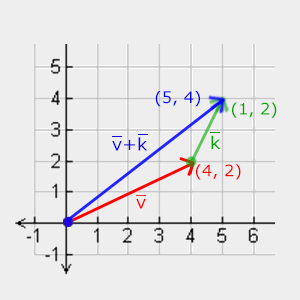
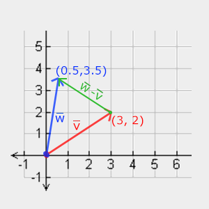
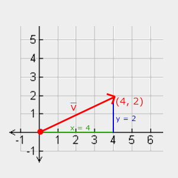
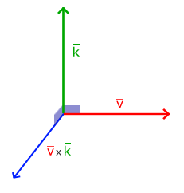

# Transformation

Transformation 的核心作用，是把“模型本身长什么样”和“模型在场景中如何摆放”分开。顶点数据只保存一份，表示模型在局部坐标系中的原始形状；而模型的位置、旋转角度、缩放比例等状态，则通过变换矩阵（*Matrix*）来控制。这样，同一个模型可以通过不同的矩阵被放到不同位置、朝向不同方向、显示成不同大小，而不需要重复创建或修改顶点数据。

在 OpenGL 中，缩放和旋转可以用矩阵表示；平移本身不是普通线性变换，但通过引入齐次坐标，也可以被统一放进 4×4 矩阵中表示。为了让平移也能通过矩阵乘法统一处理，顶点坐标通常会被扩展为四维*齐次坐标*（*Homogeneous coordinates*）。多个变换可以通过矩阵乘法组合在一起，并在 vertex shader 中作用于每个顶点。需要注意的是，矩阵乘法的顺序会影响最终结果；在列向量约定下，最右侧的变换会最先作用于顶点。

## Vector（向量）

向量表示方向或位置，当表示方向时其起点无关紧要，当表示位置时，以原点作为向量起点，向量终点即其所表示的位置。

向量可以有二维、三维或更高维。一般来说，二维向量常用于表示 2D 平面中的方向或坐标，三维向量常用于表示 3D 空间中的方向或坐标；而在 3D 图形学中，四维向量常用于表示三维空间中的齐次坐标，例如 (x, y, z, w)。其中 w 分量用于区分点和方向，并支持平移、透视投影等变换在矩阵体系中的统一计算。

向量的表示法：

$$
列向量：
\bar{v} = \begin{pmatrix} {\color{red}x} \\ {\color{green}y} \\ {\color{blue}z} \end{pmatrix}
\\
行向量：
\bar{v} = \begin{pmatrix} {\color{red}x} & {\color{green}y} & {\color{blue}z} \end{pmatrix}
$$

> 行向量和列向量是向量的两种表示约定；几何意义可以相同，但在线性代数运算中必须配套使用不同的矩阵乘法顺序。


### 向量与标量（*Scalar*）的基本运算

标量是一个数字。当对向量进行标量加、减、乘或除运算时，我们只需将向量的每个分量分别与该标量相加、相减、相乘或相除：

$$
加减：
\begin{pmatrix} {\color{red}1} \\ {\color{green}2} \\ {\color{blue}3} \end{pmatrix} + {\color{purple}x} \rightarrow \begin{pmatrix} {\color{red}1} \\ {\color{green}2} \\ {\color{blue}3} \end{pmatrix} + \begin{pmatrix} {\color{purple}x} \\ {\color{purple}x} \\ {\color{purple}x} \end{pmatrix}  = \begin{pmatrix} {\color{red}1} + {\color{purple}x} \\ {\color{green}2} + {\color{purple}x} \\ {\color{blue}3} + {\color{purple}x} \end{pmatrix}
$$

$$
乘除：
{\color{purple} c} \cdot
\begin{pmatrix}
{\color{red} x} \\ {\color{green} y} \\ {\color{blue} z}
\end{pmatrix}
=
\begin{pmatrix}
{\color{purple} c} \cdot {\color{red} x} \\ {\color{purple} c} \cdot {\color{green} y} \\ {\color{purple} c} \cdot {\color{blue} z}
\end{pmatrix}
$$

当 c = -1 时，就是向量取反，方向相反，长度不变。

### 向量与向量的加减法

$$
\bar{v} = \begin{pmatrix} {\color{red}1} \\ {\color{green}2} \\ {\color{blue}3} \end{pmatrix}, \bar{k} = \begin{pmatrix} {\color{red}4} \\ {\color{green}5} \\ {\color{blue}6} \end{pmatrix} \rightarrow \bar{v} + \bar{k} = \begin{pmatrix} {\color{red}1} + {\color{red}4} \\ {\color{green}2} + {\color{green}5} \\ {\color{blue}3} + {\color{blue}6} \end{pmatrix} = \begin{pmatrix} {\color{red}5} \\ {\color{green}7} \\ {\color{blue}9} \end{pmatrix}
$$





### 向量的长度/模

三维向量长度：

$$
||{\color{red}{\bar{v}}}|| = \sqrt{{\color{red}x}^2 + {\color{green}y}^2 + {\color{blue}z}^2}
$$

二维向量可以视为 z = 0 的特殊情况：

$$
||{\color{red}{\bar{v}}}|| = \sqrt{{\color{red}x}^2 + {\color{green}y}^2}
$$



单位向量（*Unit Vector*）是指长度为 1 的向量，任意一个向量都可以通过除以其长度得到对应的单位向量，此过程称为*归一化*：

$$
\hat{n} = \frac{\bar{v}}{||\bar{v}||}
$$

### 向量与向量的*点乘*

向量与向量的点乘/点积定义：

$$
\bar{v} \cdot \bar{k} = ||\bar{v}|| \cdot ||\bar{k}|| \cdot \cos \theta
$$

点乘的意义：衡量两个向量的方向相关性，结果越大，说明两个向量越同向；结果为 0，说明两个向量垂直；结果小于 0，说明两个向量大致反向。它也可以理解为一个向量在另一个向量方向上的投影贡献。假设两个向量都是单位向量，它们的点积正好是 $\cos \theta$：

$$
\hat{v} \cdot \hat{k} = 1 \cdot 1 \cdot \cos \theta = \cos \theta
$$

### 向量与向量的*叉乘*

在三维空间中，两个向量的叉乘结果是一个与二者都垂直（正交，*orthogonal*）的向量。当两个向量平行或其中一个为零向量时，叉乘结果为零向量，此时没有明确的方向。非平行情况下，结果向量的长度表示这两个向量张成的平行四边形面积，其方向可以表示两个向量的旋转/朝向关系：

$$
\begin{pmatrix} {\color{red}{A_{x}}} \\ {\color{green}{A_{y}}} \\ {\color{blue}{A_{z}}} \end{pmatrix} \times \begin{pmatrix} {\color{red}{B_{x}}} \\ {\color{green}{B_{y}}} \\ {\color{blue}{B_{z}}}  \end{pmatrix} = \begin{pmatrix} {\color{green}{A_{y}}} \cdot {\color{blue}{B_{z}}} - {\color{blue}{A_{z}}} \cdot {\color{green}{B_{y}}} \\ {\color{blue}{A_{z}}} \cdot {\color{red}{B_{x}}} - {\color{red}{A_{x}}} \cdot {\color{blue}{B_{z}}} \\ {\color{red}{A_{x}}} \cdot {\color{green}{B_{y}}} - {\color{green}{A_{y}}} \cdot {\color{red}{B_{x}}} \end{pmatrix}
$$



## Matrix（矩阵）

矩阵常用于表示空间变换。缩放、旋转属于线性变换；平移和透视投影虽然不是普通三维线性变换，但在齐次坐标体系下，也可以通过 4×4 矩阵统一表示。**矩阵是描述空间变换的工具，它可以把一个向量或一组顶点按照统一规则变换到新的位置。**

### 矩阵与矩阵的加减法

只有维度相同的矩阵可以进行加减法：

$$
\begin{bmatrix} {\color{red}1} & {\color{red}2} \\ {\color{green}3} & {\color{green}4} \end{bmatrix} + \begin{bmatrix} {\color{red}5} & {\color{red}6} \\ {\color{green}7} & {\color{green}8} \end{bmatrix} = \begin{bmatrix} {\color{red}1} + {\color{red}5} & {\color{red}2} + {\color{red}6} \\ {\color{green}3} + {\color{green}7} & {\color{green}4} + {\color{green}8} \end{bmatrix} = \begin{bmatrix} {\color{red}6} & {\color{red}8} \\ {\color{green}{10}} & {\color{green}{12}} \end{bmatrix}
$$

$$
\begin{bmatrix} {\color{red}4} & {\color{red}2} \\ {\color{green}1} & {\color{green}6} \end{bmatrix} - \begin{bmatrix} {\color{red}2} & {\color{red}4} \\ {\color{green}0} & {\color{green}1} \end{bmatrix} = \begin{bmatrix} {\color{red}4} - {\color{red}2} & {\color{red}2}  - {\color{red}4} \\ {\color{green}1} - {\color{green}0} & {\color{green}6} - {\color{green}1} \end{bmatrix} = \begin{bmatrix} {\color{red}2} & -{\color{red}2} \\ {\color{green}1} & {\color{green}5} \end{bmatrix}
$$

### 矩阵与标量的乘法

$$
{\color{green}2} \cdot \begin{bmatrix} 1 & 2 \\ 3 & 4 \end{bmatrix} = \begin{bmatrix} {\color{green}2} \cdot 1 & {\color{green}2} \cdot 2 \\ {\color{green}2} \cdot 3 & {\color{green}2} \cdot 4 \end{bmatrix} = \begin{bmatrix} 2 & 4 \\ 6 & 8 \end{bmatrix}
$$

### 矩阵与矩阵的乘法

矩阵乘法需满足：
1. 只有当左侧矩阵的列数等于右侧矩阵的行数时，才能对两个矩阵进行乘法运算。
2. 矩阵乘法不满足交换律，即 $A \cdot B \neq B \cdot A$。

矩阵乘法的运算规则是：左矩阵的每一行分别与右矩阵的每一列做点乘，得到结果矩阵中对应位置的元素。例如结果矩阵里的第 i 行第 j 列元素，就是：结果[i][j] = 左矩阵第 i 行 · 右矩阵第 j 列

$$
\begin{bmatrix} {\color{red}1} & {\color{red}2} \\ {\color{green}3} & {\color{green}4} \end{bmatrix} \cdot \begin{bmatrix} {\color{blue}5} & {\color{purple}6} \\ {\color{blue}7} & {\color{purple}8} \end{bmatrix} = \begin{bmatrix} {\color{red}1} \cdot {\color{blue}5} + {\color{red}2} \cdot {\color{blue}7} & {\color{red}1} \cdot {\color{purple}6} + {\color{red}2} \cdot {\color{purple}8} \\ {\color{green}3} \cdot {\color{blue}5} + {\color{green}4} \cdot {\color{blue}7} & {\color{green}3} \cdot {\color{purple}6} + {\color{green}4} \cdot {\color{purple}8} \end{bmatrix} = \begin{bmatrix} 19 & 22 \\ 43 & 50 \end{bmatrix}
$$

$$
\begin{bmatrix} {\color{red}4} & {\color{red}2} & {\color{red}0} \\ {\color{green}0} & {\color{green}8} & {\color{green}1} \\ {\color{blue}0} & {\color{blue}1} & {\color{blue}0} \end{bmatrix} \cdot \begin{bmatrix} {\color{red}4} & {\color{green}2} & {\color{blue}1} \\ {\color{red}2} & {\color{green}0} & {\color{blue}4} \\ {\color{red}9} & {\color{green}4} & {\color{blue}2} \end{bmatrix} = \begin{bmatrix} {\color{red}4} \cdot {\color{red}4} + {\color{red}2} \cdot {\color{red}2} + {\color{red}0} \cdot {\color{red}9} & {\color{red}4} \cdot {\color{green}2} + {\color{red}2} \cdot {\color{green}0} + {\color{red}0} \cdot {\color{green}4} & {\color{red}4} \cdot {\color{blue}1} + {\color{red}2} \cdot {\color{blue}4} + {\color{red}0} \cdot {\color{blue}2} \\ {\color{green}0} \cdot {\color{red}4} + {\color{green}8} \cdot {\color{red}2} + {\color{green}1} \cdot {\color{red}9} & {\color{green}0} \cdot {\color{green}2} + {\color{green}8} \cdot {\color{green}0} + {\color{green}1} \cdot {\color{green}4} & {\color{green}0} \cdot {\color{blue}1} + {\color{green}8} \cdot {\color{blue}4} + {\color{green}1} \cdot {\color{blue}2} \\ {\color{blue}0} \cdot {\color{red}4} + {\color{blue}1} \cdot {\color{red}2} + {\color{blue}0} \cdot {\color{red}9} & {\color{blue}0} \cdot {\color{green}2} + {\color{blue}1} \cdot {\color{green}0} + {\color{blue}0} \cdot {\color{green}4} & {\color{blue}0} \cdot {\color{blue}1} + {\color{blue}1} \cdot {\color{blue}4} + {\color{blue}0} \cdot {\color{blue}2} \end{bmatrix} 
 \\ = \begin{bmatrix} 20 & 8 & 12 \\ 25 & 4 & 34 \\ 2 & 0 & 4 \end{bmatrix}
$$

### 矩阵与向量的乘法

向量可以视为 Nx1 或 1xN 的矩阵，从而与矩阵进行乘法运算。矩阵与向量乘法的几何意义是：用矩阵描述一套空间变换规则，然后把这个规则应用到向量或点上，得到变换后的结果（从原来的方向、长度或位置变成新的方向、长度或位置）。

> 注意！向量可以按约定表示为 n×1 的列向量，也可以表示为 1×n 的行向量；不同表示方式决定了它与矩阵相乘时的位置。若 M 是 m×n 矩阵，v 是 n×1 列向量，则应写作 Mv，结果为 m×1 列向量；若 v 是 1×n 行向量，M 是 n×m 矩阵，则应写作 vM，结果为 1×m 行向量。由于矩阵乘法不可交换，同一个矩阵和同一个向量改变相乘顺序后，通常不会得到相同结果。OpenGL/GLSL 中通常采用列向量约定，因此顶点变换常写作 M * v，也就是把向量放在矩阵右侧。

#### 单位矩阵（*Identity Matrix*）

单位矩阵是对角线（左上角到右下角）元素值均为 1 且其它元素值均为 0 的 NxN 矩阵：

$$
\begin{bmatrix} {\color{red}1} & {\color{red}0} & {\color{red}0} & {\color{red}0} \\ {\color{green}0} & {\color{green}1} & {\color{green}0} & {\color{green}0} \\ {\color{blue}0} & {\color{blue}0} & {\color{blue}1} & {\color{blue}0} \\ {\color{purple}0} & {\color{purple}0} & {\color{purple}0} & {\color{purple}1} \end{bmatrix}
$$

在 3D 图形学中，通常把三维位置扩展为四维齐次坐标向量，例如将点表示为 (x, y, z, 1)，这样就可以用 4×4 矩阵统一表示平移、旋转、缩放等变换。所以在 OpenGL 中，我们通常使用 4x4 矩阵和四维向量，当使用 4x4 单位矩阵乘以四维列向量时，会发现单位矩阵的特殊性在于它不会产生任何变换：

$$
\begin{bmatrix} {\color{red}1} & {\color{red}0} & {\color{red}0} & {\color{red}0} \\ {\color{green}0} & {\color{green}1} & {\color{green}0} & {\color{green}0} \\ {\color{blue}0} & {\color{blue}0} & {\color{blue}1} & {\color{blue}0} \\ {\color{purple}0} & {\color{purple}0} & {\color{purple}0} & {\color{purple}1} \end{bmatrix} \cdot \begin{bmatrix} 1 \\ 2 \\ 3 \\ 4 \end{bmatrix} = \begin{bmatrix} {\color{red}1} \cdot 1 \\ {\color{green}1} \cdot 2 \\ {\color{blue}1} \cdot 3 \\ {\color{purple}1} \cdot 4 \end{bmatrix} = \begin{bmatrix} 1 \\ 2 \\ 3 \\ 4 \end{bmatrix}
$$

在构造变换矩阵时，通常先从单位矩阵开始，因为单位矩阵本身不改变向量；随后依次叠加平移、旋转、缩放等变换，最终得到用于顶点变换的组合矩阵。

#### 缩放

对向量进行缩放时，可以进行均匀缩放（*uniform scale*），即每个分量的缩放比例一致，也可以是非均匀缩放（*non-uniform scale*），即每个分量的缩放比例不一。我们可以构建一个缩放矩阵，令其与向量相乘来实现向量的缩放：

$$
\begin{bmatrix} {\color{red}{S_1}} & {\color{red}0} & {\color{red}0} & {\color{red}0} \\ {\color{green}0} & {\color{green}{S_2}} & {\color{green}0} & {\color{green}0} \\ {\color{blue}0} & {\color{blue}0} & {\color{blue}{S_3}} & {\color{blue}0} \\ {\color{purple}0} & {\color{purple}0} & {\color{purple}0} & {\color{purple}1} \end{bmatrix} \cdot \begin{pmatrix} x \\ y \\ z \\ 1 \end{pmatrix} = \begin{pmatrix} {\color{red}{S_1}} \cdot x \\ {\color{green}{S_2}} \cdot y \\ {\color{blue}{S_3}} \cdot z \\ 1 \end{pmatrix}
$$

#### 平移

$$
\begin{bmatrix}  {\color{red}1} & {\color{red}0} & {\color{red}0} & {\color{red}{T_x}} \\ {\color{green}0} & {\color{green}1} & {\color{green}0} & {\color{green}{T_y}} \\ {\color{blue}0} & {\color{blue}0} & {\color{blue}1} & {\color{blue}{T_z}} \\ {\color{purple}0} & {\color{purple}0} & {\color{purple}0} & {\color{purple}1} \end{bmatrix} \cdot \begin{pmatrix} x \\ y \\ z \\ 1 \end{pmatrix} = \begin{pmatrix} x + {\color{red}{T_x}} \\ y + {\color{green}{T_y}} \\ z + {\color{blue}{T_z}} \\ 1 \end{pmatrix}
$$

> 齐次坐标通过给三维向量增加 w 分量，使平移和透视投影等操作也能统一用矩阵乘法表示；其中 w = 1 通常表示点，w = 0 通常表示方向向量。

> 在齐次坐标中，当 w ≠ 0 时，$(\frac{x}{w},\frac{y}{w},\frac{z}{w},1)$ 和 $(x,y,z,w)$ 表示同一个三维点；它们不是相同的四维向量，但是是等价的齐次坐标表示。

#### 旋转

任意一个三维旋转，都等价于绕某一根轴旋转某个角度，即*轴角*表示。（**注意这里只是说最终的效果，不是指“旋转过程”**）

下面的旋转矩阵采用右手坐标系、列向量约定。如果使用行向量、左手系或不同的主动/被动旋转解释，矩阵中的正负号和乘法顺序可能不同。

绕 X 轴旋转：

$$
\begin{bmatrix} {\color{red}1} & {\color{red}0} & {\color{red}0} & {\color{red}0} \\ {\color{green}0} & {\color{green}{\cos \theta}} & - {\color{green}{\sin \theta}} & {\color{green}0} \\ {\color{blue}0} & {\color{blue}{\sin \theta}} & {\color{blue}{\cos \theta}} & {\color{blue}0} \\ {\color{purple}0} & {\color{purple}0} & {\color{purple}0} & {\color{purple}1} \end{bmatrix} \cdot \begin{pmatrix} x \\ y \\ z \\ 1 \end{pmatrix} = \begin{pmatrix} x \\ {\color{green}{\cos \theta}} \cdot y - {\color{green}{\sin \theta}} \cdot z \\ {\color{blue}{\sin \theta}} \cdot y + {\color{blue}{\cos \theta}} \cdot z \\ 1 \end{pmatrix}
$$

绕 Y 轴旋转：

$$
\begin{bmatrix} {\color{red}{\cos \theta}} & {\color{red}0} & {\color{red}{\sin \theta}} & {\color{red}0} \\ {\color{green}0} & {\color{green}1} & {\color{green}0} & {\color{green}0} \\ - {\color{blue}{\sin \theta}} & {\color{blue}0} & {\color{blue}{\cos \theta}} & {\color{blue}0} \\ {\color{purple}0} & {\color{purple}0} & {\color{purple}0} & {\color{purple}1} \end{bmatrix} \cdot \begin{pmatrix} x \\ y \\ z \\ 1 \end{pmatrix} = \begin{pmatrix} {\color{red}{\cos \theta}} \cdot x + {\color{red}{\sin \theta}} \cdot z \\ y \\ - {\color{blue}{\sin \theta}} \cdot x + {\color{blue}{\cos \theta}} \cdot z \\ 1 \end{pmatrix}
$$

绕 Z 轴旋转：

$$
\begin{bmatrix} {\color{red}{\cos \theta}} & - {\color{red}{\sin \theta}} & {\color{red}0} & {\color{red}0} \\ {\color{green}{\sin \theta}} & {\color{green}{\cos \theta}} & {\color{green}0} & {\color{green}0} \\ {\color{blue}0} & {\color{blue}0} & {\color{blue}1} & {\color{blue}0} \\ {\color{purple}0} & {\color{purple}0} & {\color{purple}0} & {\color{purple}1} \end{bmatrix} \cdot \begin{pmatrix} x \\ y \\ z \\ 1 \end{pmatrix} = \begin{pmatrix} {\color{red}{\cos \theta}} \cdot x - {\color{red}{\sin \theta}} \cdot y  \\ {\color{green}{\sin \theta}} \cdot x + {\color{green}{\cos \theta}} \cdot y \\ z \\ 1 \end{pmatrix}
$$

绕任意轴 $({\color{red}{R_x}}, {\color{green}{R_y}}, {\color{blue}{R_z}})$ 旋转，其中 $({\color{red}{R_x}}, {\color{green}{R_y}}, {\color{blue}{R_z}})$ 应为单位向量，即轴方向需要先归一化：

$$
\begin{bmatrix} \cos \theta + {\color{red}{R_x}}^2(1 - \cos \theta) & {\color{red}{R_x}}{\color{green}{R_y}}(1 - \cos \theta) - {\color{blue}{R_z}} \sin \theta & {\color{red}{R_x}}{\color{blue}{R_z}}(1 - \cos \theta) + {\color{green}{R_y}} \sin \theta & 0 \\ {\color{green}{R_y}}{\color{red}{R_x}} (1 - \cos \theta) + {\color{blue}{R_z}} \sin \theta & \cos \theta + {\color{green}{R_y}}^2(1 - \cos \theta) & {\color{green}{R_y}}{\color{blue}{R_z}}(1 - \cos \theta) - {\color{red}{R_x}} \sin \theta & 0 \\ {\color{blue}{R_z}}{\color{red}{R_x}}(1 - \cos \theta) - {\color{green}{R_y}} \sin \theta & {\color{blue}{R_z}}{\color{green}{R_y}}(1 - \cos \theta) + {\color{red}{R_x}} \sin \theta & \cos \theta + {\color{blue}{R_z}}^2(1 - \cos \theta) & 0 \\ 0 & 0 & 0 & 1 \end{bmatrix}
$$

任意三维旋转姿态，既可以用“绕某一根轴旋转某个角度”的轴角形式表示，也可以用“绕三个指定坐标轴依次旋转”的欧拉角形式表示。在常见的 OpenGL / Y-up 约定中，可以理解为：

yaw   ：绕 Y 轴转多少
pitch ：绕 X 轴转多少
roll  ：绕 Z 轴转多少

但 yaw/pitch/roll 与具体 X/Y/Z 轴的对应关系并非数学上固定不变，而是取决于所采用的坐标系和旋转顺序。

这三个数字按某个固定顺序组合起来，就表示一个最终旋转姿态。需要注意的是，**欧拉角的旋转顺序很重要**，不是三个独立随便加的角度，而是“按指定顺序绕指定轴旋转”的三个角度组合。

欧拉角总能表示一个最终旋转姿态，只是同一个姿态可能对应多组欧拉角，并且在某些姿态附近会退化，即两个旋转轴的效果重合，导致一个旋转自由度在控制上丢失，此状态叫万向节锁，*Gimbal lock*。

万向节锁通常发生在欧拉角三次旋转中的“第二个旋转角”达到特殊值（cos 值为 0）时，此时第一次旋转轴和第三次旋转轴会重合或方向相反。例如在某些 yaw-pitch-roll 约定下，当 pitch = 90° 时，yaw 和 roll 不再是两个独立控制量。此时 yaw=45°, pitch=90°, roll=0° 可能和 yaw=0°, pitch=90°, roll=45° 得到相同或等价的最终姿态。具体是 +45° 还是 -45°，取决于旋转顺序、左右手系和内旋/外旋约定；但核心现象不变：两个角度的控制效果重合了。

> 如果用欧拉角，也就是三个旋转角度，来记录或累积旋转，就很容易受到万向节锁影响。原因是欧拉角并不是一条可靠的“连续旋转历史记录”，而是对当前最终姿态的一种参数化表示。  
> 在普通姿态下，yaw、pitch、roll 看起来像三个独立的旋转自由度；但当第二个旋转角达到特殊值，例如常见 yaw-pitch-roll 中 pitch = ±90° 时，第一次旋转轴和第三次旋转轴会重合，使得 yaw 和 roll 不再能表达两个独立的旋转方向。  
> 例如在 yaw=10°, pitch=90°, roll=0° 的基础上，如果想“再 roll 1°”，直接修改欧拉角的 roll 值并不一定能表达我们期望的“基于当前姿态继续滚转”。在万向节锁状态下，这个变化可能与修改 yaw 分量得到相同或等价的最终姿态。也就是说，系统已经无法通过欧拉角稳定地区分“再 yaw 一点”和“再 roll 一点”。  
> 因此，欧拉角适合用于输入、显示和简单编辑，但不适合用作程序内部长期累积旋转的状态。更常见的做法是用四元数或旋转矩阵累积旋转，需要显示给人看时再转换为欧拉角。

直接累积旋转矩阵可以避免欧拉角的万向节锁问题，但矩阵经过长期连续相乘后，会因为浮点误差逐渐偏离“纯旋转矩阵”，从而引入微小的缩放、剪切或轴不再正交的问题（旋转矩阵需要满足三个轴互相垂直以及每个轴长度都是 1）。

工程上通常分别记录 position、rotation、scale，其中 rotation 用单位四元数（*quaternion*）累积，渲染时再组合成 T * R * S 的 model 矩阵。

#### 变换叠加

通过将矩阵相乘，可以实现多个变换的叠加，需要注意的是，按习惯向量被视为列向量进行运算，因此右侧的矩阵被先作用于向量，比如如果我们要先放大 2 倍，再平移 $(1,2,3)$，我们要按以下顺序构建矩阵：

$$
Trans \cdot Scale = \begin{bmatrix} {\color{red}1} & {\color{red}0} & {\color{red}0} & {\color{red}1} \\ {\color{green}0} & {\color{green}1} & {\color{green}0} & {\color{green}2} \\ {\color{blue}0} & {\color{blue}0} & {\color{blue}1} & {\color{blue}3} \\ {\color{purple}0} & {\color{purple}0} & {\color{purple}0} & {\color{purple}1} \end{bmatrix} \cdot \begin{bmatrix} {\color{red}2} & {\color{red}0} & {\color{red}0} & {\color{red}0} \\ {\color{green}0} & {\color{green}2} & {\color{green}0} & {\color{green}0} \\ {\color{blue}0} & {\color{blue}0} & {\color{blue}2} & {\color{blue}0} \\ {\color{purple}0} & {\color{purple}0} & {\color{purple}0} & {\color{purple}1} \end{bmatrix} = \begin{bmatrix} {\color{red}2} & {\color{red}0} & {\color{red}0} & {\color{red}1} \\ {\color{green}0} & {\color{green}2} & {\color{green}0} & {\color{green}2} \\ {\color{blue}0} & {\color{blue}0} & {\color{blue}2} & {\color{blue}3} \\ {\color{purple}0} & {\color{purple}0} & {\color{purple}0} & {\color{purple}1} \end{bmatrix}
$$

然后按以下顺序进行矩阵与向量的乘法：

$$
\begin{bmatrix} {\color{red}2} & {\color{red}0} & {\color{red}0} & {\color{red}1} \\ {\color{green}0} & {\color{green}2} & {\color{green}0} & {\color{green}2} \\ {\color{blue}0} & {\color{blue}0} & {\color{blue}2} & {\color{blue}3} \\ {\color{purple}0} & {\color{purple}0} & {\color{purple}0} & {\color{purple}1} \end{bmatrix} . \begin{bmatrix} x \\ y \\ z \\ 1 \end{bmatrix} = \begin{bmatrix} {\color{red}2x} + {\color{red}1} \\ {\color{green}2y} + {\color{green}2}  \\ {\color{blue}2z} + {\color{blue}3} \\ 1 \end{bmatrix}
$$


## 代码实现

### GLM 库

OpenGL 没有内置矩阵与向量相关的内容，要在程序中使用，可借助 GLM（OpenGL Mathematics）库，一个纯头文件库。

```cpp
#include <glm/glm.hpp>
#include <glm/gtc/matrix_transform.hpp>
#include <glm/gtc/type_ptr.hpp>
```

```cpp
// 1. 定义向量
glm::vec4 vec(1.0f, 0.0f, 0.0f, 1.0f);
// 2. 创建一个单位矩阵，然后叠加一个平移变换
glm::mat4 trans = glm::mat4(1.0f);
trans = glm::translate(trans, glm::vec3(1.0f, 1.0f, 0.0f));
// 3. 将矩阵与向量相乘实现变换
vec = trans * vec;
// 4. 输出应为 2 1 0
std::cout << vec.x << ' ' << vec.y << ' ' << vec.z << std::endl;
```

```cpp
// 旋转与缩放变换
// 注意：在列向量约定下，最终矩阵为 R * S 时，真正作用到顶点上的顺序是先 缩放 后 旋转，也就是说，代码调用顺序和顶点实际经历的变换顺序并不总是同一个方向理解。一般建议实际变换顺序按 缩放、旋转、平移 的顺序进行。
glm::mat4 trans = glm::mat4(1.0f);
trans = glm::rotate(trans, glm::radians(90.0f), glm::vec3(0.0f, 0.0f, 1.0f));
trans = glm::scale(trans, glm::vec3(0.5f, 0.5f, 0.5f)); 
```

### Shader 中使用矩阵

GLSL 支持 `mat2`、`mat3`、`mat4` 类型，对于变换，我们使用 `mat4` 即可：

```glsl
#version 330 core
layout (location = 0) in vec3 aPos;
layout (location = 1) in vec2 aTexCoord;

out vec2 TexCoord;
  
uniform mat4 transform;

void main()
{
    gl_Position = transform * vec4(aPos, 1.0);
    // 注意，纹理坐标是指顶点坐标对应的纹理坐标，当前例子只变换顶点位置，不变换纹理坐标。
    // 纹理坐标仍会经过光栅化插值后传给 fragment shader。
    TexCoord = aTexCoord;
} 
```

程序将 GLM 矩阵传给 Shader：

```cpp
unsigned int transformLoc = glGetUniformLocation(ourShader.ID, "transform");
glUniformMatrix4fv(transformLoc, 1, GL_FALSE, glm::value_ptr(trans));
```

`glUniformMatrix4fv()` 的第三个参数表示是否要在传入时转置（*transpose*，即交换矩阵的行和列）矩阵。OpenGL 按列优先方式解释矩阵数据，GLM 默认矩阵布局也是列优先，因此这里传 `GL_FALSE`，表示不需要额外转置。第四个参数需要的是指向连续 `float` 数据的指针，而 `glm::mat4` 是一个 C++ 对象，不能直接作为 `float*` 传入。因此使用 `glm::value_ptr(trans)` 取得矩阵内部数据的首地址。

在渲染循环中，根据时间变化更新变换矩阵，并设置给 Shader 的 Uniform 后再调用绘制命令，即可实现动画效果：

```cpp
glm::mat4 trans = glm::mat4(1.0f);
trans = glm::translate(trans, glm::vec3(0.5f, -0.5f, 0.0f));
trans = glm::rotate(trans, (float)glfwGetTime(), glm::vec3(0.0f, 0.0f, 1.0f));
```
