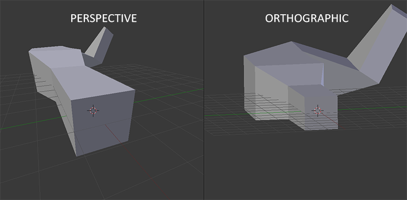
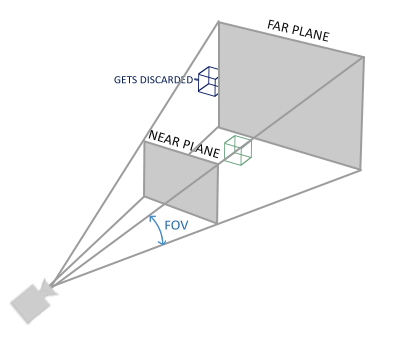

# 06_坐标系统 Coordinate Systems

## 核心流程

OpenGL 中顶点坐标变换到 NDC 的大致经历：


```text
Local Space
    ↓ model matrix
World Space
    ↓ view matrix
View Space
    ↓ projection matrix
Clip Space
    ↓ perspective division
NDC
    ↓ viewport transform
Screen Space
```

对应 shader 中常见写法（注意矩阵从右往左作用）：

```glsl
gl_Position = projection * view * model * vec4(aPos, 1.0);
```

## 各坐标空间含义

### Local Space（局部空间 / 物体空间）

模型原始顶点坐标所在的空间，便于描述模型自身形状。这只是模型自己的尺寸和形状，不代表它在场景中的位置。

### World Space（世界空间）

通过 `model matrix` 把模型从局部空间放到世界中，不同的模型可以被缩放、旋转、平移到想要的世界位置上，可以认为这一步就是在构建一个 3D 世界/场景，也就是决定物体在世界中的位置、朝向、大小。

### View Space（观察空间 / 摄像机空间）

通过 `view matrix` 把世界坐标转换到*摄像机视角*下，这一步可以认为是在确定我们以何种视角去观察构建出来的 3D 世界/场景。

注意！OpenGL 本身没有真正的摄像机对象。所谓摄像机，通常是我们通过 view 矩阵和 projection 矩阵模拟出来的。OpenGL 最终接收的是裁剪空间坐标，经过透视除法得到 NDC，再根据 NDC 的 x、y 决定屏幕位置，并根据 NDC 的 z 生成深度值。

> NDC 的 z 会经过 depth range 映射，默认从 `[-1, 1]` 映射到窗口深度 `[0, 1]`，再用于深度测试。也就是：z_window = z_ndc * 0.5 + 0.5

例如逻辑上要将摄像机放到 (0, 0, 3) 的位置，实际上是令场景移动 (0, 0, -3)：

```cpp
glm::mat4 view{ 1.0f };
view = glm::translate(view, glm::vec3(0.0f, 0.0f, -3.0f));
```

OpenGL 常规理解：

```text
摄像机看向 -Z 方向
```

### Clip Space（裁剪空间）

`projection matrix` 把 view space 转换到 clip space。Vertex Shader 输出的 `gl_Position` 就是裁剪空间坐标。

> *投影矩阵定义了观察空间中的可见范围*。对于透视投影，可见范围是视锥体（*frustum*）；对于正交投影，可见范围更像一个长方体盒子。凡是位于可见区域内的坐标，最终都会显示在用户的屏幕上。

普通顶点在 view space 中通常是 (x, y, z, 1)，经过透视投影矩阵后，会变成 (x_clip, y_clip, z_clip, w_clip)，其中 w_clip 通常由原来的深度 z 决定，不同深度的顶点会得到不同的 w。

裁剪空间坐标不是 NDC 或屏幕坐标，而是四维齐次坐标 $(x, y, z, w)$，理论上通过透视除法（各分量除以 w）转换为 $(x / w, y / w, z / w)$ 后，再检查是否处于 NDC，若处于 NDC 则保留，否则裁剪。但实际上 OpenGL 会直接根据裁剪空间坐标是否满足 [-w, w] 来判断是否可见（本质上是在提前判断它透视除法后会不会落入 NDC）：

```text
-w <= x <= w
-w <= y <= w
-w <= z <= w
```

### NDC（Normalized Device Coordinates，标准化设备坐标）

裁剪之后，OpenGL 自动执行透视除法：

```text
x_ndc = x_clip / w_clip
y_ndc = y_clip / w_clip
z_ndc = z_clip / w_clip
```

得到 NDC。

NDC 范围：

```text
x: [-1, 1]
y: [-1, 1]
z: [-1, 1]
```

注意：

```text
gl_Position 不是 NDC
NDC 是 gl_Position 除以 w 之后的结果
```

### Screen Space（屏幕空间）

NDC 经过 `glViewport` 映射到窗口坐标，这个过程叫*viewport transform*。

例如：

```cpp
glViewport(0, 0, 800, 600);
```

大致表示：

```text
NDC x: [-1, 1] → screen x: [0, 800]
NDC y: [-1, 1] → screen y: [0, 600]
```

> 注意：OpenGL 的窗口坐标原点通常在左下角，因此 viewport transform 后，窗口坐标的 y 方向通常是向上的；这和很多窗口系统 / 图片坐标中“左上角为原点、y 向下”的习惯不同。

## Model / View / Projection 变换

### Model Matrix

局部空间 → 世界空间的变换，决定单个物体在哪里、朝向如何、大小如何。

同一个 VAO / VBO 可以用不同的 model matrix 绘制多个物体。

### View Matrix

世界空间 → 观察空间，决定从哪个位置、哪个方向观察世界。

常见理解是*移动摄像机 = 反向移动世界*。

> 需要注意的是，一般认为摄像机看向 -Z 方向，也就是摄像机的 front 和摄像机坐标系的正 Z 方向相反！

### Projection Matrix

观察空间 → 裁剪空间，决定相机的可见范围（视锥体，frustum），以及是否有透视效果。

常见两种：

- 正交投影（orthographic projection）
- 透视投影（perspective projection）



## 正交投影


```cpp
glm::mat4 projTrans = glm::ortho(left, right, bottom, top, near, far);
```

特点：

```text
没有近大远小
远近不影响物体大小
适合 2D、工程视图、正交视图
```

## 透视投影



```cpp
glm::mat4 projTrans = glm::perspective(fov, aspect, near, far);
```

参数：

```text
fov     视野角
aspect  宽高比
near    近平面
far     远平面
```

特点：

```text
近大远小
更接近真实视觉
可见范围是视锥体 frustum
```

**透视效果的关键在于 `w`，透视投影后，远处顶点通常会得到更大的 `w`，执行透视除法后，远处顶点除完后更靠近中心，因此看起来更小。**

## 深度测试

绘制 3D 物体时需要启用深度测试，否则 OpenGL 默认主要按绘制顺序覆盖颜色，不能正确处理前后遮挡关系：

```cpp
glEnable(GL_DEPTH_TEST);
```

另外，每帧绘制前还需要清除颜色缓冲和深度缓冲：

```cpp
glClear(GL_COLOR_BUFFER_BIT | GL_DEPTH_BUFFER_BIT);
```

深度测试依赖 depth buffer / z-buffer，其本质上和 frame buffer 类似，只是每个像素对应的不是颜色，而是深度值，当新的片段生成时，会比较新片段的深度和 depth buffer 中对应位置的深度，默认情况下，OpenGL 使用 `GL_LESS` 作为深度比较函数（`glDepthFunc(GL_LESS);`），也就是新的片段深度值更小时才通过测试、得以保留，否则会被抛弃。

## 单个模型的重复使用

多个相同模型不需要复制顶点数据，常见做法：

```text
共用 VAO / VBO
每个物体使用不同 model matrix
每次绘制前更新 model uniform
```

示意：

```cpp
for (...) {
    glm::mat4 model = glm::mat4(1.0f);
    model = glm::translate(model, position);
    shader.setMat4("model", model);
    glDrawArrays(...);
}
```
