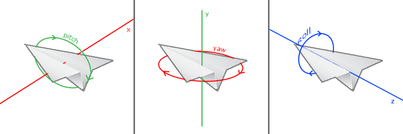
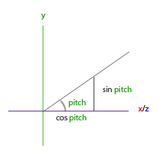

# 实现“摄像机”

OpenGL 本身没有定义摄像机概念，但是通过 view 和 projection 矩阵变换，我们可以抽象出一个摄像机的概念。view 矩阵实现从 world space 到 view space （摄像机空间）的变换，决定了摄像机的位置 + 姿态（朝向和旋转）。projection 矩阵实现从 view space 到 clip space 的变换，决定了摄像机的可见区域及投影（3D 坐标转 2D 坐标）方式。

实现一个“摄像机”，可以理解为假设一个摄像机，在知道其位置、姿态、可见区域（视锥体）的情况下，如何构建出对应的 view 和 projection 矩阵。

## LookAt 方法构造 view 矩阵

如果我们有摄像机的位置 $\vec{pos}$、朝向 $\vec{front}$ 和一个“参考垂直向上方向” $\vec{up}$，那么借助 *LookAt* 方法，就可以构建出对应的 view 矩阵：

```cpp
auto viewMat = glm::lookAt(pos, pos + front, up);
```

$$
LookAt = \begin{bmatrix} \textcolor{red}{R_x} & \textcolor{red}{R_y} & \textcolor{red}{R_z} & 0 \\ \textcolor{green}{U_x} & \textcolor{green}{U_y} & \textcolor{green}{U_z} & 0 \\ \textcolor{blue}{D_x} & \textcolor{blue}{D_y} & \textcolor{blue}{D_z} & 0 \\ 0 & 0 & 0  & 1 \end{bmatrix} * \begin{bmatrix} 1 & 0 & 0 & -\textcolor{purple}{P_x} \\ 0 & 1 & 0 & -\textcolor{purple}{P_y} \\ 0 & 0 & 1 & -\textcolor{purple}{P_z} \\ 0 & 0 & 0  & 1 \end{bmatrix}
$$

R 是右向量，U 是上向量，D 是方向向量（D 不是摄像机“看向”的方向，而是 view space 的 +Z 轴在世界坐标中的方向，$\vec{direction} = -\vec{front}$），P 是相机的位置向量

> 注意！摄像机的 $\vec{front}$ 并不是 view space 的 Z 轴正方向，$\vec{direction} = -\vec{front}$ 才是。因为 OpenGL 惯例是摄像机看向 Z 轴负方向。

因为 LookAt 实际使用的是摄像机的 $\vec{target}$ 而不是 $\vec{front}$，所以叫 LookAt。但是实际应用时，建议保留 $\vec{front}$，以便移动摄像机时计算新的位置。

$\vec{target}$ 和 $\vec{front}$ 可以互相转换：

```cpp
front = target - pos
target = pos + front
```

所谓 $\vec{up}$，是一个用于参考的“上方向”，也常被称作“世界坐标的上方向”，一般 fly-style 和 FPS 摄像机的 $\vec{up}$ 就使用世界坐标系的 $(0, 1, 0)$。最终摄像机局部 Y 轴 $\vec{realUp}$ 会落在由朝向 $\vec{front}$ 和 $\vec{up}$ 张成的半平面内。

$\vec{up}$ 的作用是通过 $\vec{up} \times \vec{direction}$ 得到摄像机的 $\vec{right}$，也就是 view space 的 X 轴方向。最终又可以通过 $\vec{realUp} = \vec{direction} \times \vec{right}$ 得到真实的摄像机 up 方向。


虽然仅需 $\vec{pos}$、$\vec{front}$、$\vec{up}$ 即可构建 view 矩阵，但是实际应用中建议缓存 $\vec{right}$ 和 $\vec{realUp}$，以便移动摄像机时计算新位置。

## 摄像机的移动

摄像机的移动，就是根据需要，通过 $\vec{front}$ 和 $\vec{right}$ 更新 $\vec{pos}$：

```cpp
void processInput(GLFWwindow *window)
{
    ...
    const float speed = 0.05f;
    const float distance = speed * deltaTime;
    if (glfwGetKey(window, GLFW_KEY_W) == GLFW_PRESS)
        cameraPos += distance * cameraFront;
    if (glfwGetKey(window, GLFW_KEY_S) == GLFW_PRESS)
        cameraPos -= distance * cameraFront;
    // 如果有 right 向量，则无需再计算 front 和 up 的叉积
    if (glfwGetKey(window, GLFW_KEY_A) == GLFW_PRESS)
        cameraPos -= glm::normalize(glm::cross(cameraFront, worldUp)) * distance;
    if (glfwGetKey(window, GLFW_KEY_D) == GLFW_PRESS)
        cameraPos += glm::normalize(glm::cross(cameraFront, worldUp)) * distance;
}
```

一般 $\vec{front}$ 和 $\vec{right}$ 都会标准化，以便参与移动距离的计算，移动距离等于速度乘以时间，时间即渲染循环的帧间隔。需要注意的是，如果使用帧间隔时间，那么移动操作就必须是“主动”进行的，也就是在每一帧中主动调用 `processInput()` 对按键状态进行检查，而不能依靠 GUI 框架的按键回调事件，因为按键回调事件有自己的时间间隔！

## 摄像机的朝向（基于欧拉角）



对于常见的 FPS / fly-style 相机，计算 $\vec{front}$，或者说基于 LookAt 方法构建摄像机时，仅需要关心 yaw 和 pitch，无需关心 roll（可以这么做是因为 LookAt 方法用了一个固定的 $\vec{up}$）。

假设逆时针为正，起始方向是 X 轴正方向，那么 $\vec{front}$ 的 x 和 z 与 yaw 有以下关系：


```cpp
glm::vec3 front;
front.x = cos(glm::radians(yaw));
front.z = sin(glm::radians(yaw));
```

$\vec{front}$ 的 y 与 pitch 有以下关系：



```cpp
front.y = sin(glm::radians(pitch));  
```

从 pitch 示意图中可以看到，xz 平面投影受 $\cos(pitch)$ 的影响，我们需要确保这一点也包含在方向向量中。将这一点考虑在内后，我们便得到了由 yaw 和 pitch 欧拉角转换而来的最终方向向量：

```cpp
front.x = cos(glm::radians(yaw)) * cos(glm::radians(pitch));
front.y = sin(glm::radians(pitch));
front.z = sin(glm::radians(yaw)) * cos(glm::radians(pitch));
```

需要注意的是，因为起始方向定义为 X 轴正方向，所以默认情况下若 yaw 和 pitch 都为 0，front 是世界坐标的 X 轴正方向。如果需要默认情况下 front 就是 Z 轴负方向，要么 yaw 默认为 $-90^\circ$，要么改用以下公式（初始方向定义为 Z 轴负方向，推导逻辑类似）：

```cpp
front.x = -sin(glm::radians(yaw)) * cos(glm::radians(pitch));
front.y = sin(glm::radians(pitch));
front.z = -cos(glm::radians(yaw)) * cos(glm::radians(pitch));
```

实际应用中，通过缓存 yaw 和 pitch，再在鼠标移动时（或每帧主动检查鼠标位置变化）更新 yaw 和 pitch，进而更新 $\vec{front}$。

需要注意的是，pitch 应该被限制在 (-90, 90) 之间，若 pitch 为 $\pm90^\circ$，则 $\vec{front}$、$\vec{direction}$ 与参考上方向/世界上方向 $\vec{up}$ 平行，无法通过叉乘得到 $\vec{right}$：

```cpp
if(pitch > 89.0f)
  pitch =  89.0f;
if(pitch < -89.0f)
  pitch = -89.0f;
```

## Zoom 的实现

这里的“缩放”更准确地说是摄像机视角缩放 / zoom，而不是物体模型缩放。实现 zoom 通常只需要修改透视投影矩阵生成时使用的 fov 参数：fov 越小，画面看起来越“放大”；fov 越大，画面看起来越“广角”。