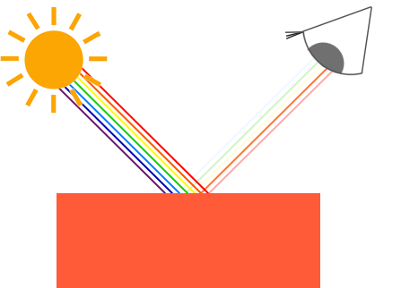
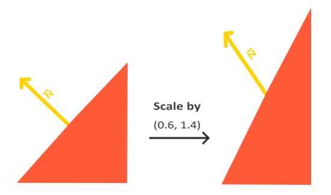
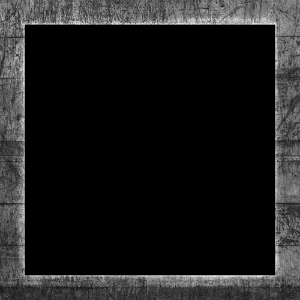

# 颜色计算的基础

物体的颜色本质上是由物体反射的光组成的颜色。一个蓝色的物体是将蓝色以外的光吸收了，仅反射蓝色光而呈现的蓝色。如果光线是纯红光，理论上物体会是黑色的，因为红光会被物体吸收而非反射。（现实世界中绝大多数物体做不到真正的全部吸收）



程序中可以通过 `vec3` 或 `vec4` 分别表示 RGB 和 RGBA 颜色。通过分别定义光颜色、物体/片段颜色，再进行向量的逐分量乘法，就可以模拟计算物体/片段所反射的颜色：

```cpp
glm::vec3 lightColor(1.0f, 1.0f, 1.0f);
glm::vec3 toyColor(1.0f, 0.5f, 0.31f);
glm::vec3 result = lightColor * toyColor; // = (1.0f, 0.5f, 0.31f);
lightColor = glm::vec3(0.0f, 1.0f, 0.0f);
result = lightColor * toyColor; // = (0.0f, 0.5f, 0.0f);
lightColor = glm::vec3(0.33f, 0.42f, 0.18f);
result = lightColor * toyColor; // = (0.33f, 0.21f, 0.06f);
```

# Phong 光照模型

现实世界中的光照非常复杂，要通过有限的算力模拟现实光照，只能依靠一些简化的模型，比如 *Phong 光照模型（Phong lighting/reflection model）*，它将物体（片段，fragment）的颜色分为三个部分：

1. 环境光（Ambient）：模拟场景中的间接光/其它物体反射的光，避免背光面完全变黑。
2. 漫反射光（Diffuse）：模拟粗糙表面对光的散射，这是视觉上最重要的组成部分，其亮度取决于片段法线与入射光方向的夹角。
3. 镜面反射光（Specular）：模拟表面的高光，亮度取决于反射光是否朝向观察者/摄像机，且颜色更倾向于光的颜色而不是物体的颜色。


要实现 Phong 光照模型，需要光源和物体/片段材质分别定义三种颜色，将对应颜色相乘后再加起来，就是物体/片段的最终颜色：

```cpp
struct Light {
    glm::vec3 ambient;
    glm::vec3 diffuse;
    glm::vec3 specular;
    // ...
};
struct Material {
    glm::vec3 ambient;
    glm::vec3 diffuse;
    glm::vec3 specular;
    // ...
};
glm::vec3 final_color = light.ambient * material.ambient * ambient_strength
    + light.diffuse * material.diffuse * diffuse_strength
    + light.specular * material.specular * specular_strength;
```

> Phong 光照模型在片段着色器实现，叫 *Phong shading*，若是在顶点着色器实现，则叫 *Gouraud shading*。在顶点着色器中进行光照计算的优势在于效率更高，因为顶点数量通常远少于片段，因此（耗时的）光照计算执行的频率较低。然而，顶点着色器生成的颜色值仅代表该顶点的光照颜色，而周围片段的颜色值则是通过插值光照颜色得出的。结果是，除非使用大量顶点，否则光照效果不太逼真。\


## Ambient

片段的 Ambient 基本上就是用光的 ambient 乘以材质的 ambient，且材质的 ambient 往往和材质的 diffuse 一样，只是光的 ambient 会很暗（颜色值小）。

```glsl
ambient = light.ambient * material.ambient;
```

## Diffuse


片段的 Diffuse 需要用光的 diffuse 乘以材质的 diffuse，再乘以一个强度系数，该系数表示**光线方向与法线方向的对齐程度**，即片段法线（*normal*，垂直于平面的向量，指向平面外侧）与入射光夹角的 cos 值，法线向量和光线方向向量都为单位向量的情况下，可以通过点乘计算强度系数。

```glsl
// 注意点乘的向量方向和 max() 的使用，max() 处理 cos 值为负的情况
diff = max(dot(normal, -light_direction), 0.0);
diffuse = light.diffuse * material.diffuse * diff;
```

## Specular


片段的 Specular 需要用光的 specular 乘以材质的 specular，再乘以一个强度系数，该系数由两个部分组成：

1. 表示**反射光线与观察者视线的平行程度**，即反射光线与观察视线夹角 $\theta$ 的 cos 值，反射光线向量和视线方向向量都为单位向量的情况下，可以通过点乘计算强度系数。
2. 高光指数（*shininess*），shininess 越大，结果衰减越快，高光越集中；shininess 越小，高光范围越宽。强度系数即 $\cos{\theta}$ 的 shininess 次方。


```glsl
// 通过 reflect() 可以计算反射光方向，注意向量的方向
reflect_light = normalize(reflect(light_direction, normal));
spec = pow(max(dot(reflect_light, to_camera), 0.0), shininess);
specular = light.specular * material.specular * spec;
```

## 法线的传递与转换（法线矩阵）

法线可以作为顶点数据传递给 vertex shader，再由 vertex shader 通过 out 变量插值、传递给 fragment shader。

```glsl
// vertex shader
layout (location = 1) vec3 a_normal;
```

```cpp
struct Vertex {
    glm::vec3 position;
    glm::vec3 normal;
};
glVertexAttribPointer(1, 3, GL_FLOAT, GL_FALSE,
    sizeof(Vertex), reinterpret_cast<const void*>(offsetof(Vertex, normal)
);
glEnableVertexAttribArray(1);
```

但是法线并不是位置，只是方向，所以：

1. 我们只需要 4x4 变换矩阵的左上 3x3 部分，不需要平移
2. 若变换存在非均匀缩放，则法线变换后会变得不再垂直于顶点平面（见下图）



为了解决上述问题，需要使用特殊的法线矩阵（*normal matrix*）来对法线进行变换，法线矩阵是模型变换线性部分（左上 3×3）的逆转置矩阵（先求逆、再转置）：

```glsl
// vertex shader
// 如果要在世界空间使用法线
v_normal = normalize(mat3(transpose(inverse(model))) * a_normal);
// 如果要在视图空间使用法线
v_normal = normalize(mat3(transpose(inverse(view * model))) * a_normal);
```

# 光照贴图（Lighting Map）

光照贴图是纹理的一种应用，在没有引入光照计算的情况下，片段的颜色通过纹理直接获取，引入光照计算后，片段的颜色需要先从纹理获取到基础颜色，再与光照进行计算，并且片段的颜色会分为两类，从两种纹理获取：

1. 基础颜色贴图/漫反射贴图（*diffuse map*）：物体/片段的基础颜色来源，计算片段颜色时，从 diffuse map 获取片段的颜色，然后再参与 ambient 和 diffuse 光照计算。\

2. 高光贴图（*specular map*）：物体/片段的高光颜色来源，计算片段的高光颜色（specular）时，从 specular map 获取片段的颜色。使非高光部分（如木材）的纹理颜色为黑色，高光部分（如金属）的纹理颜色为非黑色，可以实现仅让物体的高光部分有高光。\


