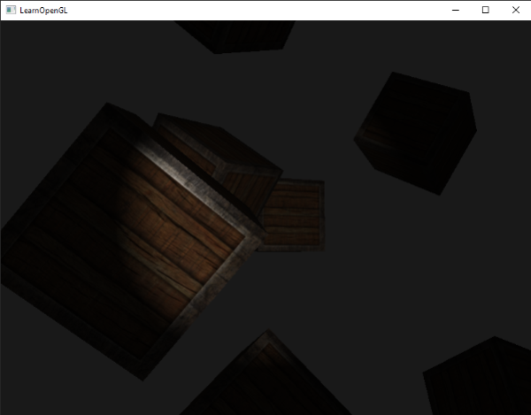

投光物（Light Caster）是图形学中对光源作用方式的一种抽象（光源模型），用于描述光线如何照射场景中的物体。可以分为三种基本类型：

1. 方向光（*Directional light*）：可以理解为来自无限远处的光源，因此场景中所有片段接收到的光方向都相同，模拟太阳光这类光。
2. 点光（*Point light*）：有位置，没有方向的光，模拟灯泡这类光。
3. 聚光（*Spot light*）：有位置，有方向，还有一个截止角（*cutoff angle*），模拟手电筒、聚光灯这类光。

这三种光源都可以有自己的 ambient、diffuse、specular。

## 方向光

方向光没有什么特殊的，计算片段的 diffuse、specular 颜色时，直接用光的方向、片段法线、摄像机方向进行计算即可。

## 点光

点光计算时需要注意两点：

1. 光的方向需要根据点光的位置和片段的位置进行计算，然后再参与 diffuse、specular 的计算。
2. 光的强度会随着距离变大而衰减（*attenuation*），衰减系数公式为：$\begin{equation} F_{att} = \frac{1.0}{K_c + K_l * d + K_q * d^2} \end{equation}$\
    其中：
    1. $d$ 为距离（distance），通过点光位置与片段位置计算。
    2. $K_c$ 为常量，通常就是 1.0，使光源在距离接近 0 时不会出现无限大的强度。
    3. $K_l$ 为线性（linear）部分，使光强呈线性衰减。
    4. $K_q$ 为平方（quadratic）部分，当距离较小时，二次项的影响相对于线性项较小，但随着距离的增大，其影响会显著增大。


根据光线方向、视线方向等参数计算出的 ambient、diffuse 和 specular，再乘以衰减系数即片段在此光投物作用下的颜色。

> 是否让 ambient 参与衰减并没有统一标准。实际应用中 ambient 往往不参与衰减，甚至很多现代渲染系统不会将 ambient 作为光源的一部分，而是通过全局环境光、环境贴图等方式单独处理环境光照。

|Distance|Constant|Linear|Quadratic|
|-|-|-|-|
|7|1.0|0.7|1.8|
|13|1.0|0.35|0.44|
|20|1.0|0.22|0.20|
|32|1.0|0.14|0.07|
|50|1.0|0.09|0.032|
|65|1.0|0.07|0.017|
|100|1.0|0.045|0.0075|
|160|1.0|0.027|0.0028|
|200|1.0|0.022|0.0019|
|325|1.0|0.014|0.0007|
|600|1.0|0.007|0.0002|
|3250|1.0|0.0014|0.000007|

## 聚光

聚光的特殊之处在于其截止角（*cutoff angle*），截止角表示聚光所能照亮的角度范围。


上图中 $\phi$ 表示截止角，$\theta$ 表示从聚光位置指向片段的方向与聚光照射方向之间的夹角，仅当 $\theta < \phi$ 时，片段才会被聚光照亮。

实际编程中，为了方便进行角度比较，截止角往往用角度值对应的 cos 值表示，而片段的 $\theta$，则通过点积计算，从而也得到 cos 值，随后用 cos 值进行比较，若 $\cos{\theta} > \cos{\phi}$ 则表示片段位于聚光范围内。


如果只根据片段的光线与聚光夹角是否小于截止角来决定片段是否被照亮，则聚光的光强只有有和没有两种状态，会导致视觉上聚光会有一个“硬边”：


解决此问题的方法是将聚光的截止角分为两个，一个内截止角（*inner cutoff*） $\phi$ 和一个外截止角 $\gamma$（*outer cutoff*）。当片段的 $\theta < \phi$ 时，聚光强度为 1，当 $\gamma > \theta > \phi$ 时，聚光强度线性插值至 $(0, 1)$ 范围，若 $\theta > \gamma$ 则聚光强度为 0。



聚光强度计算公式可以总结为：

$$
\begin{equation} I = \frac{\cos{\theta} - \cos{\gamma}}{\cos{\phi} - \cos{\gamma}} \end{equation}
$$

实际应用时，注意使用 `clamp()` 将强度系数限制在 $[0, 1]$：

```glsl
float theta     = dot(light_direction, normalize(-light.direction));
// epsilon 表示内外截止角对应 cos 值之间的差值。
float epsilon   = light.cutoff - light.outer_cutoff;
// 注意 clamp 的使用
float intensity = clamp((theta - light.outer_cutoff) / epsilon, 0.0, 1.0);    
// ...
// ambient 可以考虑不受 intensity 影响
diffuse  *= intensity;
specular *= intensity;
```

## 多光源

当场景中有多个光源时，只需要将每个光源对片段产生的作用叠加即可，也就是令每个光源计算出一个对应的片段颜色，然后全部加起来。

> 多个光源叠加后颜色分量可能超过 [0,1] 范围，最终会受到颜色缓冲格式、HDR 或色调映射等机制影响。