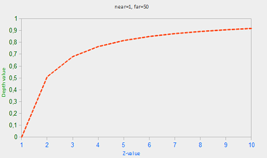
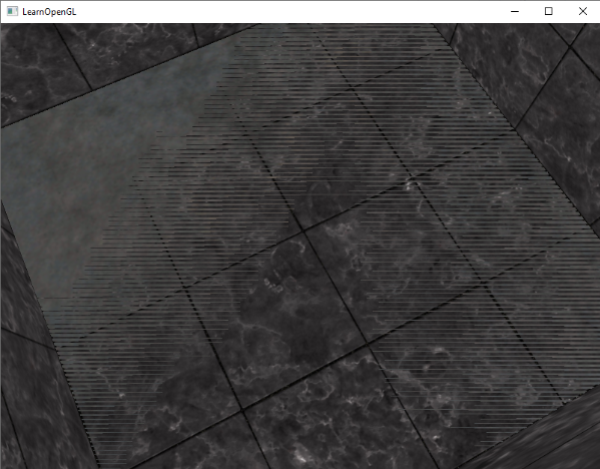

# 深度测试

深度测试（Depth Test）通过比较当前片段与深度缓冲（Depth Buffer）中的对应位置的深度值（默认情况下范围是 $[0, 1]$，值越大表示越深也就是越远），决定该片段是否可见，从而正确处理物体之间的遮挡关系。

深度测试发生在 Fragment Shader 和 Stencil Test 之后，但是现代 GPU 也支持提前深度测试（*Early Depth Test/Eary-Z*），提前深度测试发生在 Fragment Shader 之前，从而避免执行代价较高的 Fragment Shader。它属于 GPU 的一种优化，并非 OpenGL 保证的行为；通常要求 Fragment Shader 不会修改最终深度（如写入 `gl_FragDepth`），且不会执行影响深度测试结果的操作（如 discard），否则可能退化为普通的深度测试。

Depth Buffer 是类似 Color Buffer 的一个缓存，有着同样的宽高，只是存储的是片段的深度值，常见精度有 16 位、24 位和 32 位。

在 Fragment Shader 中，可以通过 `gl_FragCoord` 变量（vec4 类型）访问当前片段的屏幕空间坐标，假设视口通过 `glViewport(x0, y0, width, height)` 设置，则

$$
gl\_FragCoord.x = \frac{x_{ndc}+1}{2} \times width + x_0\\
gl\_FragCoord.y = \frac{y_{ndc}+1}{2} \times height + y_0\\
gl\_FragCoord.z = \frac{z_{ndc}+1}{2}\\
gl\_FragCoord.w = \frac{1}{gl\_Position.w}，即透视除法系数
$$

# 深度测试相关函数

1. `glEnable(GL_DEPTH_TEST)`、`glDisable(GL_DEPTH_TEST)`
    开关深度测试。若深度测试开启，则片段在深度测试未通过时会被丢弃，若没有开启深度测试，则不会因为深度测试而丢弃片段。
2. `glClearDepthf(GLfloat depth)` 或 `glClearDepth(GLdouble depth)`
    设置清除深度缓存的值，当清除深度缓存时会使用此值，默认为 1.0。
3. `glClear(GL_DEPTH_BUFFER_BIT)`
    清除深度缓存，在开启深度测试的情况下，一般每次渲染循环都会和颜色缓存一起清理：`glClear(GL_COLOR_BUFFER_BIT | GL_DEPTH_BUFFER_BIT);`。
4. `glDepthMask(GLboolean flag)`
    开关深度缓存的写入，若开启写入，则深度测试通过的片段的深度值，会写入深度缓存，起到更新片段深度的效果，若关闭，则即便通过深度测试，也不会写入新的深度值。
5. `glDepthFunc(GLenum func)`
    设置深度测试的*比较*操作方式，默认为 `GL_LESS`，即片段深度值小于缓存深度值时为通过，还支持 `GL_ALWAYS`、`GL_NEVER`、`GL_LESS`、`GL_EQUAL`、`GL_LEQUAL`、`GL_GREATER`、`GL_NOTEQUAL`、`GL_GEQUAL`。

# 深度值的精度

对于透视投影，视图空间中的 z 在经过投影矩阵和透视除法后，会非线性地映射到深度缓存，因此深度值与 $\frac{1}{z}$ 成正比。深度值的大部分精度集中分布在靠近近平面的区域，这使得我们能够对附近的物体获得较高的深度精度。

考虑到近平面（near）和远平面（far）的设定，片段的深度值与 z 值的关系如下：

$$
F_{depth} = \frac{1/z - 1/near}{1/far - 1/near}
$$



通过在 Fragment Shader 中将深度值视为颜色输出，可以直观观察深度值：

```glsl
out_color = vec4(vec3(gl_FragCoord.z), 1.0);
```

但是因为深度值与 z 值非线性映射，所以要想观察到线性的深度值效果，需要：

1. 将 $[0, 1]$ 的深度值，映射回 $[-1, 1]$ 的 NDC Z 坐标
2. 通过公式 $linearDepth = \frac{2.0 * near * far}{far + near - z_{ndc} * (far - near)}$ 将 NDC Z 坐标反算得到视图空间深度（严格来说是 $−z_{view}$ 的正值）。

```glsl
#version 330 core
out vec4 FragColor;

float near = 0.1; 
float far  = 100.0; 
  
float LinearizeDepth(float depth) 
{
    float z = depth * 2.0 - 1.0; // back to NDC 
    return (2.0 * near * far) / (far + near - z * (far - near));	
}

void main()
{
    float depth = LinearizeDepth(gl_FragCoord.z) / far; // !!! divide by far for demonstration
    FragColor = vec4(vec3(depth), 1.0);
}
```


> 注意！Shader 中的 near 和 far 不要求完全对应投影矩阵的 near 和 far，它们只是决定了反向变换对应的范围。若 Shader 中的 far 小于投影矩阵的 far，则观察到的白色范围会更大。

# Z-Fighting

Z-Fighting 是指两个片段的深度值过于接近，超过深度缓存的能够区分的精度，导致深度测试无法稳定判断前后关系，从而出现表面闪烁、交替显示等现象。

产生原因是深度缓冲精度有限，且透视投影下深度值呈非线性分布：靠近近平面的精度高，距离越远精度越低，因此远处更容易发生 Z-Fighting。




常见解决方法：

1. 避免两个表面共面，适当增加微小偏移（最有效）。
2. 尽可能增大近平面（Near Plane），提高深度精度。
3. 使用更高精度的深度缓存（如 24 位或 32 位）。