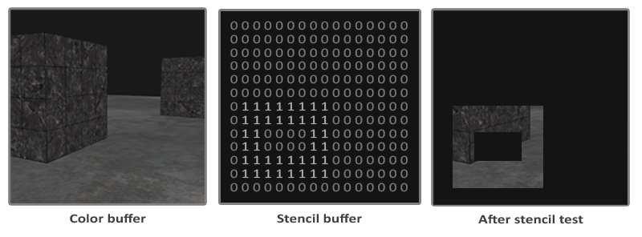

# 模板测试

模板测试（*Stencil Test*）发生在 Fragment Shader 之后，Depth Test 之前，通过比较当前片段与模板缓冲（*Stencil Buffer*）中对应位置的模板值，根据比较结果决定片段是否通过测试，并可在测试前后按规则更新模板值，从而实现对特定区域的标记与限制。模板缓冲区一般为 8 位精度，相当于支持 256 种模板值。

模板测试本质上是一种基于模板缓冲的区域掩码机制（Region Masking Mechanism），用于控制哪些像素可以参与后续渲染，实现*区域遮罩*的能力。描边、镜子、阴影体、CSG 等效果，都可以基于这一能力实现。

# 区域遮罩基本操作步骤

1. 使能模板测试
2. 使能模板缓冲区的写入
3. 渲染用作遮罩的对象，在模板缓冲中写入指定的模板值
4. 关闭模板缓冲区的写入
5. 渲染需要遮罩的对象，根据模板缓冲中的模板值（即“遮罩”）进行模板测试，仅保留（或丢弃）满足条件的片段

# 模板测试相关函数

|||深度测试|模板测试|
|-|-|-|-|
|测试开关|`glEnable()`、`glDisable()`|`GL_DEPTH_TEST`|`GL_STENCIL_TEST`|
|缓冲区清理值||`glClearDepth()`或`glClearDepthf()`|`glClearStencil()`|
|缓冲区清理|`glClear()`|`GL_DEPTH_BUFFER_BIT`|`GL_STENCIL_BUFFER_BIT`|
|缓冲区写入控制||`glDepthMask(GLboolean flag)`，仅支持开或关|`glStencilMask(GLuint mask)`，通过位掩码控制写入值，要写入缓冲区的模板值，需先与 mask 按位与后才写入，mask 一般就是 0xff 或 0x00|
|测试方法控制||`glDepthFunc(GLenum)`，只设置深度比较的操作方式，如 `GL_LESS`|1.`glStencilFunc(GLenum func, GLint ref, GLuint mask)`：设置模板值比较方式 2.`glStencilOp(GLenum sfail, GLenum dpfail, GLenum dppass)`：设置模板缓冲区在模板与深度测试成功/失败情况下的更新方式|

关于 `glStencilFunc(GLenum func, GLint ref, GLuint mask)`：

- `func`：设置模板测试的比较方式，当一个片段进行模板测试时，会用 `(ref & mask)` 和 `(stencil & mask)` 进行比较（`stenil` 表示该片段对应的模板缓冲区值），可选的比较方式有 `GL_NEVER`、`GL_LESS`、`GL_LEQUAL`、`GL_GREATER`、`GL_GEQUAL`、`GL_EQUAL`、`GL_NOTEQUAL`、`GL_ALWAYS`。
- `ref`：设置模板测试的“参考值”，即接下来渲染的片段，在进行模板测试时，使用的模板参考值，用于和模板缓冲区的值进行比较。
- `mask`：模板参考值 `ref` 和模板缓冲区值在进行比较时，需要进行按位与的掩码，默认为全 1。

关于 `glStencilOp(GLenum sfail, GLenum dpfail, GLenum dppass)`，其设置的是模板缓冲区在不同情况下该如何更新：

- `sfail`：模板测试未通过时的操作
- `dpfail`：模板测试通过、深度测试未通过时的操作
- `dppass`：模板测试和深度测试都通过时的操作

支持的操作有：`GL_KEEP`、`GL_ZERO`、`GL_REPLACE`、`GL_INCR`、`GL_INCR_WRAP`、`GL_DECR`、`GL_DECR_WRAP`、`GL_INVERT`

# 绘制物体轮廓

1. 使能模板测试
2. `glStencilFunc(GL_ALWAYS, 1, 0xFF)` + `glStencilOp(GL_KEEP, GL_KEEP, GL_REPLACE)`，让对象的模板测试总是通过，且模板测试和深度测试都通过时，更新模板缓冲区值（从而允许物体在模板缓冲区留下“遮罩”）
3. 渲染物体
4. `glStencilMask(0x00)`关闭模板缓冲区写入，`glDisable(GL_DEPTH_TEST)`关闭深度测试
5. 将物体稍微放大
6. 切换纯色片段着色器，用于渲染纯色的外轮廓
7. 先 `glStencilFunc(GL_NOTEQUAL, 1, 0xFF)`，再绘制放大后的物体，这样就仅在模板值不为 1 的区域会绘制纯色的外轮廓
8. 恢复深度测试 `glEnable(GL_DEPTH_TEST)` 和模板缓冲区操作 `glStencilOp(GL_KEEP, GL_KEEP, GL_KEEP)`

