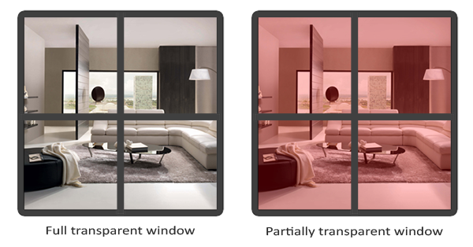
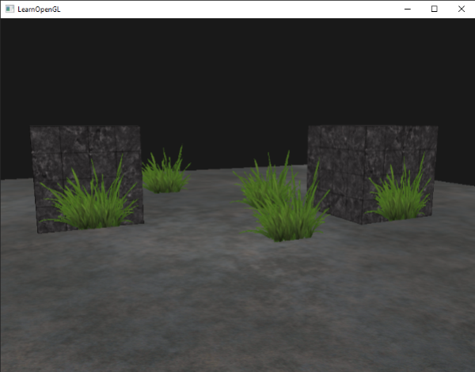
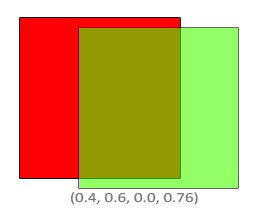

# 混合与透明

混合（Blending）是用于实现透明（Transparency）物体效果的技术，当通过一个透明/半透明物体看到其后面的物体时，最终看到的颜色是两者颜色的叠加，因此叫做 Blend。



为了实现半透明效果，物体/纹理像素（texel）的颜色需要第四个分量 *alpha*，用于表示其不透明度（*opaque*）：

1. alpha 为 0，表示 texel 完全透明，应该只显示其后面的物体的颜色
2. alpha 为 1，表示 texel 完全不透明，应该完全遮挡住后面的物体
3. alpha 为 0.3，表示 texel 的不透明度为 30%，其本身颜色的贡献度应为 30%，其后面物体颜色的贡献度应为 70%。

要支持透明/混合，纹理需要支持带 alpha 通道的颜色格式：

```cpp
glTexImage2D(GL_TEXTURE_2D, 0, GL_RGBA, width, height, 0, GL_RGBA, GL_UNSIGNED_BYTE, data);
```

> GLSL 的 `texture()` 本身就返回 `vec4`，即便纹理是 RGB 格式（此时 alpha 自动填 1.0），因此无需特别处理

# 完全透明的处理

对于完全透明或接近完全透明的 texel，也就是不需要考虑半透明混合的情况，可以通过 `discard` 将片段直接丢弃，`discard` 并不会进行颜色混合，而是直接终止当前片段的处理，因此更适合只有"显示/不显示"两种状态的透明纹理（例如草、树叶、铁丝网）：

```glsl
if(texColor.a < 0.1)
    discard;
```



> 当纹理使用双线性过滤（Linear Filtering）时，如果 Wrap Mode 为 `GL_REPEAT`，边缘 texel 会与另一侧 texel 一起参与插值，对于带 Alpha 的纹理，这会导致透明边缘与另一侧的不透明颜色混合，从而在四周产生彩色边框。解决此问题需要将环绕方式改为 `GL_CLAMP_TO_EDGE`：
> ```cpp
> glTexParameteri( GL_TEXTURE_2D, GL_TEXTURE_WRAP_S, GL_CLAMP_TO_EDGE);	
> glTexParameteri( GL_TEXTURE_2D, GL_TEXTURE_WRAP_T, GL_CLAMP_TO_EDGE);
> ```

# 半透明/混合的实现

要实现 Blending，需要使能 `GL_BLEND`：

```cpp
glEnable(GL_BLEND);
```

OpenGL 的 Blend 基本公式：

$$
Color_{result} = \textcolor{green}{Color_{src}} * \textcolor{green}{Factor_{src}} + \textcolor{red}{Color_{dst}} * \textcolor{red}{Factor_{dst}}
$$

其中源（src）表示片段着色器输出的颜色，目标（dst）表示当前颜色缓存中的颜色。此公式的具体实现可以被设置，比如系数（Factor）值的来源，源部分和目标部分的混合方式（默认为加，也可以是减、反向减、取最值）。

> 系数是 `vec4` 类型，对于 `GL_SRC_ALPHA`、`GL_DST_ALPHA` 等模式，alpha 会自动扩展为 (a,a,a,a) 作为混合系数。

`void glBlendFunc(GLenum sfactor, GLenum dfactor)` 可以用于设置源系数和目标系数的值来源：

- GL_ZERO：系数为 0
- GL_ONE：系数为 1
- GL_SRC_COLOR：系数为源颜色向量
- GL_ONE_MINUS_SRC_COLOR：系数为 $(1, 1, 1, 1)$ 减去源颜色向量
- GL_DST_COLOR：系数为目标颜色向量
- GL_ONE_MINUS_DST_COLOR：系数为 $(1, 1, 1, 1)$ 减去目标颜色向量
- GL_SRC_ALPHA：系数为源颜色的 alpha 分量
- GL_ONE_MINUS_SRC_ALPHA：系数为 1 减去源颜色的 alpha 分量
- GL_DST_ALPHA：系数为目标颜色的 alpha 分量
- GL_ONE_MINUS_DST_ALPHA：系数为 1 减去目标颜色的 alpha 分量
- GL_CONSTANT_COLOR：系数为预定义的常量颜色向量
- GL_ONE_MINUS_CONSTANT_COLOR：系数为 $(1, 1, 1, 1)$ 减去预定义的常量向量
- GL_CONSTANT_ALPHA：系数为预定义的常量 alpha 值
- GL_ONE_MINUS_CONSTANT_ALPHA：系数为 1 减去预定义的常量 alpha 值

`void glBlendColor(GLfloat red, GLfloat green, GLfloat blue, GLfloat alpha)` 用于设置`GL_CONSTANT_COLOR`、`GL_CONSTANT_ALPHA` 等模式使用的常量，默认各分量均为 0。

常见的做法是将混合的源系数和目标系数分别设为 `GL_SRC_ALPHA`、`GL_ONE_MINUS_SRC_ALPHA`，假设源颜色为半透明绿色 $(0, 1, 0, 0.6)$，目标颜色为纯红色 $(1, 0, 0, 1)$，则混合公式如下：

$$
Color_{result} = \textcolor{green}{\begin{pmatrix} 0.0 \\ 1.0 \\ 0.0 \\ 0.6 \end{pmatrix}} * \textcolor{green}{0.6} + \textcolor{red}{\begin{pmatrix} 1.0 \\ 0.0 \\ 0.0 \\ 1.0 \end{pmatrix}} * (1 - \textcolor{green}{0.6})
$$



`void glBlendFuncSeparate(GLenum srcRGB, GLenum dstRGB, GLenum srcAlpha, GLenum dstAlpha)` 可以更精细地设置系数，将颜色（RGB）部分使用的系数和 alpha 通道使用的系数分开设置。最常见的用途是让颜色按照 Alpha 混合，而 Alpha 通道采用不同的计算方式（例如直接保留源 Alpha）。

# 半透明物体的渲染顺序

深度测试只比较深度值，而不会考虑片段是否透明。因此，只要片段通过了深度测试并写入了深度缓冲，之后位于其后的片段就可能因深度测试失败而无法参与混合。因此若先渲染（相对于摄像机的）近处的半透明物体，比如玻璃，再渲染远处的物体，就会使得远处物体的片段直接被丢弃，而不是与玻璃的颜色进行混合，如下图：


解决此问题的最简单方法：不透明物体先完成颜色和深度缓冲的建立，随后透明物体只需与已有颜色进行混合即可，也就是按以下流程渲染物体：

1. 先渲染所有非透明物体
2. 按照距离相机从远到近的顺序，对所有半透明物体进行排序
3. 按排好的顺序（从远到近）依次渲染所有半透明物体


基于距离进行排序绘制的方式并不通用，因为物体的距离本身不是一个明确的定义，而且像透明物体出现交叉的情景也无法通过此方法实现正确的绘制。更高级的方法是顺序无关透明（*Order Independent Transparency，OIT*），它能够在无需排序的情况下正确处理多个透明物体之间的混合。
