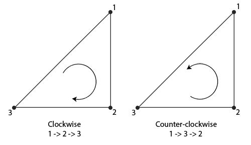

面剔除（*Face Culling*），就是将三角形图元区分为正面（*Front Face*）和背面（*Back Face*），然后根据需要自动剔除正面或者背面，从而减少需要光栅化和片段处理的三角形数量。

可以根据顶点的绕序（*Winding Order*）区分正面和背面，OpenGL 惯例是逆时针（*Counter Clockwise*）为正面，顺时针（*Clockwise*）为背面：



面剔除发生在图元装配（Primitive Assembly）之后、光栅化之前。**顶点绕序不是固定由顶点提交顺序决定，而是由顶点经过变换后在屏幕空间呈现出的二维绕序决定。**因此，一个在模型空间中按逆时针顺序定义的三角形，如果背向摄像机，在屏幕空间中会表现为顺时针绕序，从而被识别为背面。


默认情况下 OpenGL 未开启面剔除，开启面剔除的方法：

```cpp
glEnable(GL_CULL_FACE);
```

设置正面与背面判定方式：

```cpp
// GL_CCW 表示逆时针为正面，GL_CW 表示顺时针为正面
glFrontFace(GL_CCW);
```

设置需要剔除掉的面：

```cpp
// GL_FRONT、GL_BACK、GL_FRONT_AND_BACK
// 分别表示剔除正面、背面、正面与背面
glCullFace(GL_BACK);
```

> 面剔除依据的是三角形在屏幕空间中的绕序，而不是模型数据中的顶点定义顺序，因此同一个三角形会随着观察方向的变化，在正面与背面之间切换。