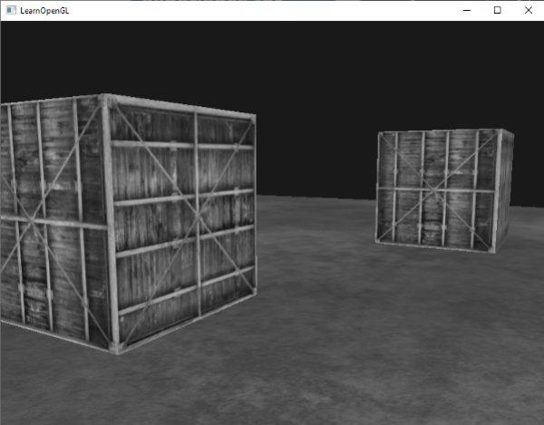
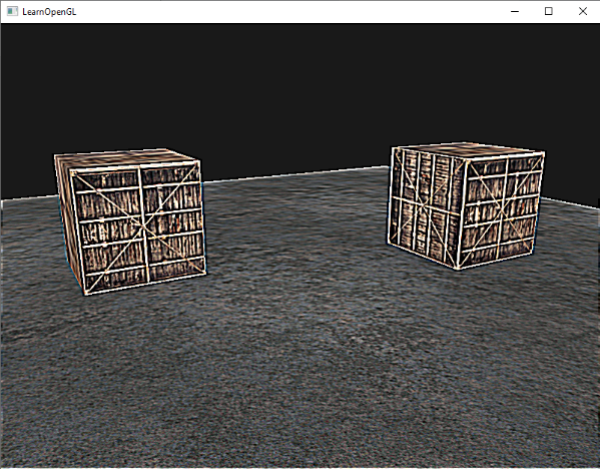

# FrameBuffer 基础

FrameBuffer（帧缓冲）是一组用于存储渲染结果的缓冲区的集合，通常包括颜色缓冲（Color Buffer），以及可选的深度缓冲（Depth Buffer）和模板缓冲（Stencil Buffer）。默认情况下，OpenGL 使用的是由窗口系统创建的默认 FrameBuffer（Default Framebuffer）。

可以创建和使用自定义的 FrameBuffer：

1. 通过 `glGenFrameBuffers()` 创建 *FrameBuffer Object（FBO）*
2. 通过 `glBindFrameBuffer()` 将 FBO 对象绑定到 `GL_FRAMEBUFFER` 绑定点（可细分为 `GL_READ_FRAMEBUFFER` 和 `GL_DRAW_FRAMEBUFFER`）
3. 为 FBO 附着一个或多个颜色、深度、模板附件（Attachment），并通过 `glCheckFramebufferStatus()` 检查 FrameBuffer 是否处于完整（Complete）状态（完整不是"缓存是否附着"，attachment format 不兼容、multisample 数量不同、attachment 尺寸不同等都会导致不完整）。
4. 绘制操作生成的数据（颜色、深度、模板）会写入到当前 FBO 的各缓存中
5. 通过 `glBindFrameBuffer(0)` 可以使用回默认 FBO，也就解除了自定义 FBO 的绑定
6. 通过 `glDeleteFrameBuffers()` 释放 FBO


```cpp
// 创建、使用 FBO：
unsigned int fbo;
glGenFramebuffers(1, &fbo);
glBindFramebuffer(GL_FRAMEBUFFER, fbo);

// attach buffers...

// 检查 FBO 的状态（主要是确认各缓存是否已经附着）：
if(glCheckFramebufferStatus(GL_FRAMEBUFFER) != GL_FRAMEBUFFER_COMPLETE) {
    // error
}

// 解绑（使用回默认 FBO）以及删除自己创建的 FBO
glBindFramebuffer(GL_FRAMEBUFFER, 0);
glDeleteFramebuffers(1, &fbo);
```

## 使用纹理作为 FBO 缓存

可以使用纹理作为 FBO 的缓存，其优点是可以将纹理用于后处理，比如将场景渲染到纹理中，然后将纹理作为镜子的贴图，实现镜面效果。

创建纹理和普通的 2D 纹理创建没有太大区别，只是 `glTexImage2D()` 设置纹理数据时，可以不提供源数据，仅要求 OpenGL 分配纹理内存，然后一般无需生成 Mipmap，因为作为渲染目标时通常只会采样第 0 级 Mipmap：

```cpp
unsigned int texture;
glGenTextures(1, &texture);
glBindTexture(GL_TEXTURE_2D, texture);
glTexImage2D(GL_TEXTURE_2D, 0, GL_RGB, 800, 600, 0, GL_RGB, GL_UNSIGNED_BYTE, NULL);
glTexParameteri(GL_TEXTURE_2D, GL_TEXTURE_MIN_FILTER, GL_LINEAR);
glTexParameteri(GL_TEXTURE_2D, GL_TEXTURE_MAG_FILTER, GL_LINEAR);
```

通过 `glFramebufferTexture2D()` 将纹理绑定到 FBO：
```cpp
glFramebufferTexture2D(GL_FRAMEBUFFER, GL_COLOR_ATTACHMENT0, GL_TEXTURE_2D, texture, 0); 
```

其参数如下：
1. target：FrameBuffer 的类型（`GL_FRAMEBUFFER`、`GL_READ_FRAMEBUFFER`、`GL_DRAW_FRAMEBUFFER`）
2. attachment：附着点类型（颜色、深度、模板），
3. textarget：纹理类型
4. texture：纹理对象 ID
5. level：纹理的 Mipmap 级别

> `GL_COLOR_ATTACHMENT0` 中的数字表示颜色附件编号，一个 FBO 可以拥有多个颜色附件（如 `GL_COLOR_ATTACHMENT0`、`GL_COLOR_ATTACHMENT1`……），用于多渲染目标（Multiple Render Targets，MRT）。

如果要用纹理作为深度、模板缓存，则创建纹理时，纹理的 internal format 应设置为深度、模板或深度模板格式，例如 `GL_DEPTH_COMPONENT24`、`GL_STENCIL_INDEX8` 或 `GL_DEPTH24_STENCIL8`，纹理的数据类型也要设为缓存类型支持的格式。
通过 `glFrameBufferTexture2D()` 附着纹理时，对应的 attachment 参数也要为 `GL_DEPTH_ATTACHMENT`、`GL_STENCIL_ATTACHMENT` 和 `GL_DEPTH_STENCIL_ATTACHMENT`，例：

```cpp
glTexImage2D(GL_TEXTURE_2D, 0, GL_DEPTH24_STENCIL8, 800, 600, 0, GL_DEPTH_STENCIL, GL_UNSIGNED_INT_24_8, NULL);

glFramebufferTexture2D(GL_FRAMEBUFFER, GL_DEPTH_STENCIL_ATTACHMENT, GL_TEXTURE_2D, texture, 0);
```

## 使用 RenderBuffer 作为缓存

相比于纹理，RenderBuffer 不能在 Shader 中进行采样，因此通常只用于存储不需要后续读取的渲染结果（如深度或模板数据）。RenderBuffer 专门用于作为渲染目标，驱动可以针对其进行优化，因此在仅作为渲染目标、不需要采样时，通常比纹理更高效。

使用 RenderBuffer 的基本步骤：

1. 通过 `glGenRenderbuffers()` 创建 RBO（Render Buffer Object）
2. 通过 `glBindRenderbuffer()` 将 RBO 绑定到绑定点 `GL_RENDERBUFFER`
3. 通过 `glRenderbufferStorage()` 为 RBO 分配内存
4. 通过 `glFramebufferRenderbuffer()` 将 RBO 附着到 FBO 上
5. 通过 `glDeleteRenderbuffers()` 释放不再需要的 RBO

```cpp
unsigned int rbo;
glGenRenderbuffers(1, &rbo);
glBindRenderbuffer(GL_RENDERBUFFER, rbo);
glRenderbufferStorage(GL_RENDERBUFFER, GL_DEPTH24_STENCIL8, 800, 600);
glFramebufferRenderbuffer(GL_FRAMEBUFFER, GL_DEPTH_STENCIL_ATTACHMENT, GL_RENDERBUFFER, rbo);
```

> 通常可以将纹理用于颜色缓存，RBO 用于深度和模板缓存，因为一般不需要读取这两个缓存的数据。

# 后处理（Post-processing）

先将场景渲染到 FBO 的颜色纹理，再绘制一个覆盖整个屏幕的 Screen Quad（四边形），在 Fragment Shader 中采样该纹理进行后处理，可以实现很多后处理效果。比如颜色反转、灰度显示等。


```glsl
void main()
{
    FragColor = vec4(vec3(1.0 - texture(screenTexture, TexCoords)), 1.0);
}
```



```glsl
void main()
{
    FragColor = texture(screenTexture, TexCoords);
    // 因为人眼对绿色比对蓝色敏感，所以采用加权计算
    float average = 0.2126 * FragColor.r + 0.7152 * FragColor.g + 0.0722 * FragColor.b;
    FragColor = vec4(average, average, average, 1.0);
}
```

## 卷积核

Kernel effects（卷积核效果），是后处理中最常见的一类图像处理技术。它通过一个很小的矩阵（Kernel，也叫 Convolution Kernel、Filter Kernel），对每个像素及其周围邻域进行加权计算，从而得到新的像素值。

简单来说，就是：一个像素的新颜色 = 它自己和周围几个像素按照一定权重计算出来的结果。

假设有一个 3×3 的卷积核：
$$
\begin{bmatrix}
-1 & -1 & -1 \\
-1 &  9 & -1 \\
-1 & -1 & -1
\end{bmatrix}
$$

对于图像中的一个像素 E：
$$
\begin{bmatrix}
A & B & C \\
D & E & F \\
G & H & I
\end{bmatrix}
$$

中心像素 E 的新颜色就是：
$$
A*(-1) + B*(-1) + C*(-1)
+ D*(-1) + E*9 + F*(-1)
+ G*(-1) + H*(-1) + I*(-1)
$$

可以在 Fragment Shader 中借助 `texture()` 进行采样、加权计算：

```glsl
uniform sampler2D screenTexture;

void main()
{
    // 一个纹素（Texel）对应的纹理坐标偏移
    vec2 texelSize = 1.0 / vec2(textureSize(screenTexture, 0));

    vec2 offsets[9] = vec2[](
        vec2(-1.0,  1.0),
        vec2( 0.0,  1.0),
        vec2( 1.0,  1.0),

        vec2(-1.0,  0.0),
        vec2( 0.0,  0.0),
        vec2( 1.0,  0.0),

        vec2(-1.0, -1.0),
        vec2( 0.0, -1.0),
        vec2( 1.0, -1.0)
    );

    float kernel[9] = float[](
        -1, -1, -1,
        -1,  9, -1,
        -1, -1, -1
    );

    vec3 color = vec3(0.0);

    for(int i = 0; i < 9; ++i)
    {
        vec2 uv = TexCoords + offsets[i] * texelSize;
        color += texture(screenTexture, uv).rgb * kernel[i];
    }

    FragColor = vec4(color, 1.0);
}
```

> 很多用于保持整体亮度的卷积核（如均值模糊、高斯模糊）的权重和为 1，这样可以避免图像整体变亮或变暗。但也有不少卷积核（如边缘检测）的权重和为 0，用于突出像素之间的变化。

常见的卷积核有

### 锐化
$$
\begin{bmatrix}
-1 & -1 & -1 \\
-1 &  9 & -1 \\
-1 & -1 & -1
\end{bmatrix}
$$



### 模糊
$$
\begin{bmatrix}
1 & 2 & 1 \\
2 &  4 & 2 \\
1 & 2 & 1
\end{bmatrix}
/ 16
$$


### 边缘检测
$$
\begin{bmatrix}
1 & 1 & 1 \\
1 & -8 & 1 \\
1 & 1 & 1
\end{bmatrix}
$$

