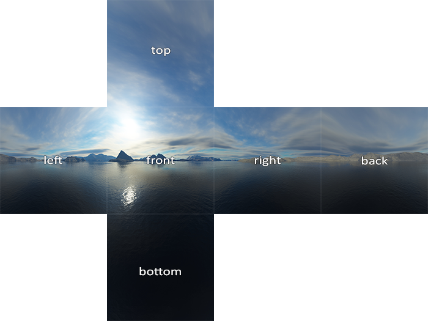
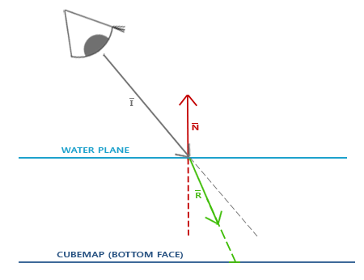
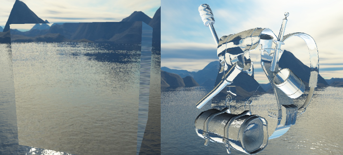

# Cubemap 基础

立方体贴图（Cubemap）纹理就是由 6 个 2D 纹理组成每个面的立方体纹理，其优点在于若将立方体的中心视为原点，则可以直接通过方向向量从立方体贴图采样，这对于实现天空盒（Skybox）和环境反射/折射非常方便。


Cubemap 纹理的创建和普通的 2D 纹理对象类似，只是纹理对象的绑定目标需要从 `GL_TEXTURE_2D` 改为 `GL_TEXTURE_CUBE_MAP`：

```cpp
unsigned int textureID;
glGenTextures(1, &textureID);
glBindTexture(GL_TEXTURE_CUBE_MAP, textureID);
```

然后由于 Cubemap 需要 6 个 2D 纹理，所以 `glTexImage2D()` 的目标需要从 `GL_TEXTURE_2D` 改为以下目标：

- `GL_TEXTURE_CUBE_MAP_POSITIVE_X`：Right
- `GL_TEXTURE_CUBE_MAP_NEGATIVE_X`：Left
- `GL_TEXTURE_CUBE_MAP_POSITIVE_Y`：Top
- `GL_TEXTURE_CUBE_MAP_NEGATIVE_Y`：Bottom
- `GL_TEXTURE_CUBE_MAP_POSITIVE_Z`：Back
- `GL_TEXTURE_CUBE_MAP_NEGATIVE_Z`：Front

它们是从 `GL_TEXTURE_CUBE_MAP_POSITIVE_X` 开始逐一递增的枚举值，所以可以通过循环进行纹理加载：

```cpp
int width, height, nrChannels;
unsigned char *data;  
for(unsigned int i = 0; i < textures_faces.size(); i++)
{
    data = stbi_load(textures_faces[i].c_str(), &width, &height, &nrChannels, 0);
    glTexImage2D(
        GL_TEXTURE_CUBE_MAP_POSITIVE_X + i, 
        0, GL_RGB, width, height, 0, GL_RGB, GL_UNSIGNED_BYTE, data
    );
}
```

Cubemap 同样可以设置 wrapping 和 filtering 方式，但是 wrapping 模式一般都是 `GL_CLAMP_TO_EDGE`，并且相比于 2D 纹理，多一个表示垂直方向 wrapping 模式的 `GL_TEXTURE_WRAP_R`：

```cpp
glTexParameteri(GL_TEXTURE_CUBE_MAP, GL_TEXTURE_MAG_FILTER, GL_LINEAR);
glTexParameteri(GL_TEXTURE_CUBE_MAP, GL_TEXTURE_MIN_FILTER, GL_LINEAR);
glTexParameteri(GL_TEXTURE_CUBE_MAP, GL_TEXTURE_WRAP_S, GL_CLAMP_TO_EDGE);
glTexParameteri(GL_TEXTURE_CUBE_MAP, GL_TEXTURE_WRAP_T, GL_CLAMP_TO_EDGE);
glTexParameteri(GL_TEXTURE_CUBE_MAP, GL_TEXTURE_WRAP_R, GL_CLAMP_TO_EDGE);
```

在 shader 中采样 Cubemap 需要借助 `samplerCube`：

```glsl
in vec3 textureDir; // direction vector representing a 3D texture coordinate
uniform samplerCube cubemap; // cubemap texture sampler

void main()
{             
    FragColor = texture(cubemap, textureDir);
}
```

# 天空盒（Skybox）

天空盒是一种用于渲染 3D 场景背景的技术，通过使用一个包围整个场景的立方体，并在其六个面上贴上对应的环境纹理（Cubemap），使玩家无论朝哪个方向观察，都能看到天空、远山、星空等远景，从而营造出无限广阔的视觉效果。




实际上天空盒不需要真的使用一个非常大的立方体网格，只需要一个小立方体（边长为 1 或 2 的立方体）即可，搭配 Cubemap 纹理，让天空盒始终与摄像机保持同一位置（通过去掉 View Matrix 的平移部分实现），从而保证观察者始终位于 Cubemap 的中心，于是立方体的顶点坐标，就是从纹理采样用的方向向量。

> 为了使天空盒立方体的中心就是视图空间原点，同时保留天空盒的旋转，需要去掉矩阵的平移部分：`glm::mat4 view = glm::mat4(glm::mat3(camera.GetViewMatrix()));`。去掉平移后，摄像机移动不会导致天空盒发生位移，但旋转仍然保留，因此天空盒会随着视角旋转，而不会产生视差。

实现天空盒的难点在于如何处理深度测试，有两种方式，一种是关闭深度测试，先绘制天空盒，但是因为没有深度测试，所以会使得无论天空盒是否可见的部分，都会生成片段，导致性能浪费。因此另一种绘制天空盒的方法是使天空盒的裁剪空间坐标 z 等于 w，这样透视除法后，天空盒的所有顶点的 z 都会是 1.0，也就是最远处：

```glsl
void main()
{
    TexCoords = aPos;
    vec4 pos = projection * view * vec4(aPos, 1.0);
    gl_Position = pos.xyww;
}
```

然后在绘制天空盒时，令深度测试的比较方法从 `GL_LESS` 改为 `GL_LEQUAL`。

# 环境映射（Environment mapping）

将一个物体的周围环境生成 6 个面的纹理，Cubemap 还可以作为一个物体的环境映射纹理，从而实现一个物体的反射与折射效果。

## 反射（Reflect）


基于视线方向向量 $\bar{I}$ 和物体的法线向量 $\bar{N}$ 计算反射向量 $\bar{R}$（可以使用 GLSL 内置的 `reflect` 函数来计算这个反射向量），得到的 $\bar{R}$ 用作方向向量来采样 Cubemap，从而返回环境的颜色值。

```glsl
#version 330 core
out vec4 FragColor;

in vec3 Normal;
in vec3 Position;

uniform vec3 cameraPos;
uniform samplerCube skybox;

void main()
{             
    vec3 I = normalize(Position - cameraPos);
    vec3 R = reflect(I, normalize(Normal));
    FragColor = vec4(texture(skybox, R).rgb, 1.0);
}
```


## 折射（Refract）

折射计算需要借助 Snell 法则：



类似的，通过视线向量 $\bar{I}$，法线向量 $\bar{N}$，和一个折射率参数，通过 GLSL 内置的 `refract` 函数，可以得到结果折射向量 $\bar{R}$ 用来采样 Cubemap。

光线从材质 A 进入 B，可通过 A 的折射率除以 B 的折射率得到 `refract()` 需要的折射率参数，一些材质的折射率如下：

- 空气：1.00
- 水：1.33
- 冰：1.309
- 玻璃：1.52
- 钻石：2.42

```glsl
void main()
{             
    float ratio = 1.00 / 1.52; // 从空气进入玻璃
    vec3 I = normalize(Position - cameraPos);
    vec3 R = refract(I, normalize(Normal), ratio);
    FragColor = vec4(texture(skybox, R).rgb, 1.0);
}
```



为了实现正确、逼真的反射、折射，需要生成一个物体周围环境的真实映射（采集 6 个方向的图像生成 Cubemap），但是动态生成的代价很大，因此实际实现时需要平衡静态 Cubemap 和动态 Cubemap 的使用。

> 静态 Cubemap 默认假设环境无限远，因此只适用于远景反射。对于靠近物体的反射，由于没有视差（Parallax），会出现明显失真。

Cubemap 不仅用于天空盒和环境映射，还广泛用于基于图像的光照（IBL）以及点光源阴影（Point Shadow Mapping）等技术。