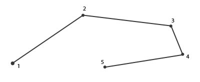
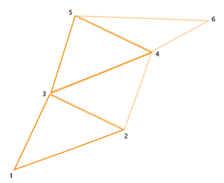
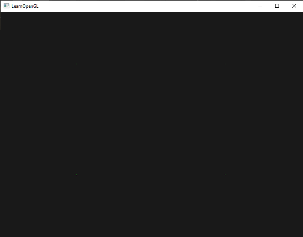
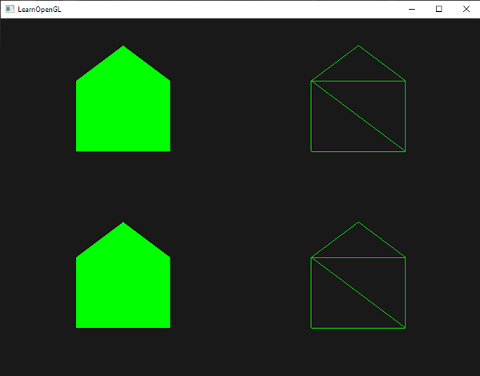
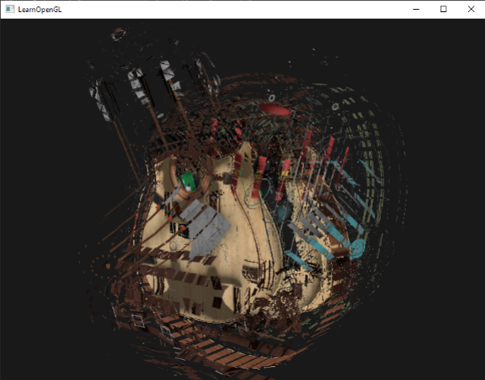
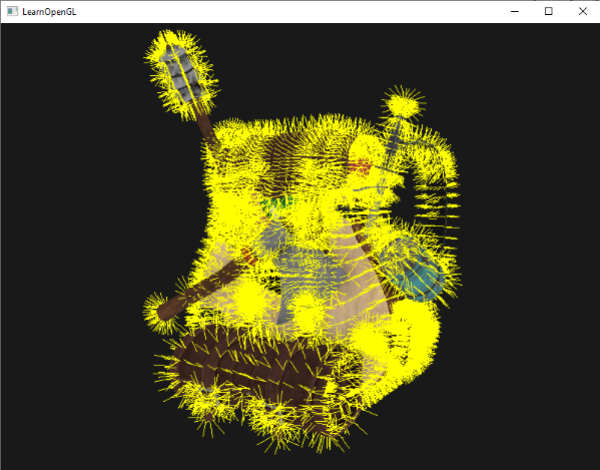

# Geometry Shader 基础


Geometry Shader 是一个可选的 Shader，位于 Vertex Shader 之后、Rasterization（光栅化）之前，因此也位于 Fragment Shader 之前。它的输入和输出都是图元（Primitive）。GS 的意义是让 GPU 能够在顶点处理之后、光栅化之前，以“图元”为单位动态修改、生成或丢弃图元，从而实现几何形状的程序化处理。

GS 的编译、链接和 VS、FS 类似：

```cpp
geometryShader = glCreateShader(GL_GEOMETRY_SHADER);
glShaderSource(geometryShader, 1, &gShaderCode, NULL);
glCompileShader(geometryShader);  
//[...]
glAttachShader(program, geometryShader);
glLinkProgram(program);  
```

在 GS 中，需要指明 GS 的输入和输出类型：

```glsl
layout (points) in; // 输入是点图元
layout (line_strip, max_vertices = 2) out; // 输出是 line_strip 图元，最多 2 个顶点
```

`in` 表示输入的图元类型，`layout()` 中的类型可以是：
- points：绘制 `GL_POINTS` 时使用，输入顶点数为 1
- lines：绘制 `GL_LINES` 或 `GL_LINE_STRIP` 时使用，输入顶点数为 2
- lines_adjacency：绘制 `GL_LINES_ADJACENCY` 或 `GL_LINE_STRIP_ADJACENCY` 时使用，输入顶点数为 4
- triangles：绘制 `GL_TRIANGLES`，`GL_TRIANGLE_STRIP` 或 `GL_TRIANGLE_FAN` 时使用，输入顶点数为 3
- triangles_adjacency：绘制 `GL_TRIANGLES_ADJACENCY` 或 `GL_TRIANGLE_STRIP_ADJACENCY` 时使用，输入顶点数为 6

`out` 表示输出的图元类型，`layout()` 中的类型可以是：
- points
- line_strip
- triangle_strip

> strip 表示顶点复用形成连续的图像，比如 3 个顶点形成 line strip，则第 2 个顶点既是第一个线段的终点，也是第二个线段的起点，三角形情况类似\
> \
> 

> adjacency 会额外提供邻接图元的顶点信息，具体略。

`in` 的顶点数表示组成图元的顶点数量，根据类型不同，顶点数是确定的。

`out` 则是通过 `layout()` 中的 `max_vertices = n` 来表明一次 GS 调用最多能够输出多少个顶点，不是一定输出这么多，也不是说图元会由这么多顶点组成，比如 GS 输出 `triangle_strip` 且 `max_vertices` 为 5 的情况下，GS 可以输出 3 个顶点组成 1 个三角形，也可以输出 4 个顶点组成 2 个三角形，或者 5 个顶点组成 3 个三角形。`max_vertices` 表示一次 Geometry Shader 调用能够输出的顶点总数，而不是单个 Primitive 的顶点数。

因为输入的图元可能由多个顶点组成，所以 GS 需要以数组的形式访问输入图元的顶点，通过内置变量 `gl_in`（一个 Interface Block）：

```glsl
in gl_Vertex
{
    vec4  gl_Position;
    float gl_PointSize;
    float gl_ClipDistance[];
} gl_in[];
```

GS 生成图元的过程大概是：
1. 将需要输出的顶点写入 `gl_Position`（以及此顶点相关 out 变量）
2. 调用 `EmitVertex()` 提交顶点（以及当前所有 out 变量）
3. 若组成图元还需要更多顶点，则回到 1，若组成图元的顶点已全部提交，则进入 4
4. 调用 `EndPrimitive()` 提交一个 primitive

两个重要的内置函数：
- `EmitVertex()`：将当前设置好的顶点属性（如 gl_Position）提交为 GS 输出的一个顶点。
- `EndPrimitive()`：结束当前正在生成的 primitive，后续 EmitVertex() 输出的顶点将开始组成新的 primitive。

> 需要注意 `EndPrimitive()` 的调用时间，假设输出 triangle_strip，提交 6 个顶点后调用一次 `EndPritive()`，会生成由 6 个顶点组成的 triangle strip，最终是 4 个共享边的三角形；同样 6 个顶点，每提交 3 个顶点后就调用一次 `EndPritive()`，会生成 2 个由 3 个顶点组成的 triangle strip，最终是 2 个三角形。

# GS 注意事项

## 坐标变换

当 GS 需要基于几何关系修改或生成顶点（如法线、爆炸效果、轮廓线）时，应延后到 GS 再进行投影变换，因为 GS 处理的是完整 primitive，需要在世界空间/视图空间中进行几何计算，投影会破坏这些空间关系。也就是说在 VS 中，顶点仅进行 model 和 view 变换，由 GS 执行最后的 projection 变换。常见做法是 VS 完成 Model 和 View 变换，GS 完成 Projection 变换，如果 GS 不需要进行几何运算，也完全可以由 VS 完成 MVP 变换。

Geometry Shader 是按 Primitive 调用，而不是按 Vertex 调用。例如绘制 100 个点，会调用 GS 100 次。绘制 100 个三角形，会调用 GS 100 次。所以坐标转换虽然可以完全在 GS 中做，但是 VS 的并行程度更高。

## 数据传递

当存在 GS 时，VS 的输出变量（包括 Interface Block）都是输出给 GS，而不是给 FS，所以如果变量被 FS 需要，则 GS 需要“转发”给 FS。注意，每次 `EmitVertex()` 都会将 GS 的输出变量和 `gl_Position` 一起作为一个顶点的数据输出：

```glsl
#version 330 core
layout (triangles) in;
layout (triangle_strip, max_vertices = 3) out;

in VS_OUT {
    vec3 worldPos;
    vec2 texCoords;
} gs_in[];

out {
    vec3 worldPos;
    vec2 texCoords;
} gs_out;

uniform mat4 projection;

void main() {
    for (int i = 0; i < 3; ++i) {
        gl_Position = projection * gl_in[i].gl_Position;
        gs_out.worldPos = gs_in[i].worldPos;
        gs_out.texCoords = gs_in[i].texCoords;
        EmitVertex();
    }
    EndPrimitive();
}
```

# GS 示例：点变成多个三角形

假设有 4 个顶点：

```cpp
float points[] = {
	-0.5f,  0.5f, // top-left
	 0.5f,  0.5f, // top-right
	 0.5f, -0.5f, // bottom-right
	-0.5f, -0.5f  // bottom-left
};
```

如果 VS 不做转换，直接将 4 个顶点视为 NDC 输出：

```glsl
#version 330 core
layout (location = 0) in vec2 aPos;

void main()
{
    gl_Position = vec4(aPos.x, aPos.y, 0.0, 1.0); 
}
```

FS 直接输出固定颜色：

```cpp
#version 330 core
out vec4 FragColor;

void main()
{
    FragColor = vec4(0.0, 1.0, 0.0, 1.0);   
}
```

在没有 GS 的情况下，`glDrawArrays(GL_POINTS, 0, 4);` 绘制的输出结果就是 4 个绿色的点：



假设我们希望 4 个点扩展为由三角形组成的房子图案：


可以借助 GS 将输入的 points 变为输出 triangle strip：

```glsl
#version 330 core
layout (points) in;
layout (triangle_strip, max_vertices = 5) out;

void build_house(vec4 position)
{
    gl_Position = position + vec4(-0.2, -0.2, 0.0, 0.0);    // 1:bottom-left
    EmitVertex();
    gl_Position = position + vec4( 0.2, -0.2, 0.0, 0.0);    // 2:bottom-right
    EmitVertex();
    gl_Position = position + vec4(-0.2,  0.2, 0.0, 0.0);    // 3:top-left
    EmitVertex();
    gl_Position = position + vec4( 0.2,  0.2, 0.0, 0.0);    // 4:top-right
    EmitVertex();
    gl_Position = position + vec4( 0.0,  0.4, 0.0, 0.0);    // 5:top
    EmitVertex();
    EndPrimitive();
}

void main() {    
    build_house(gl_in[0].gl_Position);
}
```



# GS 示例：爆炸效果（三角形沿法线移动）

要实现“爆炸”效果，可以在 GS 中将三角形沿*三角形面片的法线*进行移动，也就是让三角形的三个顶点都沿三角形面片法线移动。而要获取三角形面片的法线，可以通过向量叉乘做到：

```glsl
vec3 getNormal()
{
   vec3 a = vec3(gl_in[0].gl_Position) - vec3(gl_in[1].gl_Position);
   vec3 b = vec3(gl_in[2].gl_Position) - vec3(gl_in[1].gl_Position);
   return normalize(cross(b, a));
}
```

```glsl
vec4 explode(vec4 position, vec3 normal)
{
    return position + vec4(normal * explode_magnitude, 0.0);
}

void main()
{
    vec3 normal = getNormal();
    
    for (int i = 0; i < 3; ++i) {
        gl_Position = projection * explode(gl_in[i].gl_Position, normal);
        // 其它顶点数据，比如纹理坐标
        // gs_out.v_tex_coord = gs_in[i].v_tex_coord;
        EmitVertex();
    }
    EndPrimitive();
}
```



# GS 示例：绘制顶点法线

绘制顶点法线的原理，就是让 GS 为每个顶点新增一个顶点组成线段，新顶点通过原顶点加上法线得到，最后让 FS 给线段上色：

```glsl
#version 330 core
layout (triangles) in;
layout (line_strip, max_vertices = 6) out;

in VS_OUT {
    vec3 normal;
} gs_in[];

const float MAGNITUDE = 0.4;
  
uniform mat4 projection;

void GenerateLine(int index)
{
    gl_Position = projection * gl_in[index].gl_Position;
    EmitVertex();
    gl_Position = projection * (gl_in[index].gl_Position + 
                                vec4(gs_in[index].normal, 0.0) * MAGNITUDE);
    EmitVertex();
    EndPrimitive();
}

void main()
{
    GenerateLine(0); // first vertex normal
    GenerateLine(1); // second vertex normal
    GenerateLine(2); // third vertex normal
}
```

> 注意，在进行法线变换时（VS 中），需要使用*法线矩阵*：`mat3(transpose(inverse(view * model)))`



# GS 的性能特点

Geometry Shader 虽然能够动态生成几何体，但由于其执行粒度是 Primitive，且输出顶点数量不固定，因此在现代 GPU 上通常效率较低。

如果只是简单的实例化、大量几何生成或粒子系统，通常会优先考虑：
- Instancing
- Tessellation Shader
- Compute Shader
- Mesh Shader（现代 API）

Geometry Shader 更适合：
- 法线可视化
- 爆炸效果
- Shadow Volume
- 少量几何生成