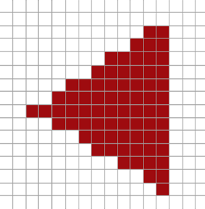
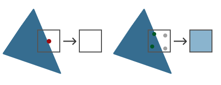
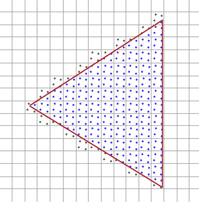
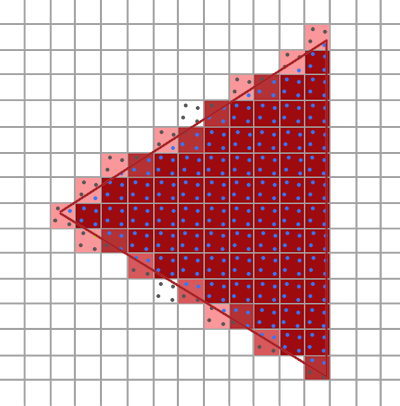

# 边缘锯齿现象

当顶点连线最终映射为屏幕上的斜线时，由于屏幕由离散的像素网格组成，连续的斜线只能通过离散的像素近似表示，因此几何边缘会呈现出阶梯状的锯齿。


光栅化器（*rasterizer*）将属于一个图元的所有顶点转换为一组片段。一个片段是否属于图元内，通过片段的采样点（*sample point*）的坐标（对应的 NDC 坐标）决定，默认情况下片段的采样点就一个：片段中心。因为片段是离散的，所以有可能一个片段的一部分属于图元内，但是其采样点却属于图元外，于是导致了阶梯状锯齿的产生：




# 抗锯齿（Anti Aliasing）的解决思路（SSAA 和 MSAA）

抗锯齿的核心思想是增加像素区域内的采样信息，根据图元对像素的覆盖程度进行颜色混合，从而使几何边缘产生平滑的颜色过渡。

最初的抗锯齿技术是超级采样（*SSAA，Super Sampler Anti Aliasing*），其做法是将场景渲染到一个比最终需要更大的 FrameBuffer 中，然后进行降采样（N 个像素合成 1 个像素）得到最终尺寸。这种做法的最终质量好，但是性能代价大，因为宽高放大 2 倍就意味着像素数量变大 4 倍，片段着色器的运行次数也就翻了大约 4 倍（**SSAA 的关键代价就是片段着色器的运行次数，而不是缓存大小**）。

多重采样（*MSAA，Multi-Sample Anti Aliasing*）的思路和 SSAA 类似，但是它不是直接使用更大的 FrameBuffer，而是将像素/片段的采样点细分为 N 个子采样点（*Subsample Point*），MSAA 同样需要更大的缓存（N 个子采样点则对应 N 倍的缓存），但是对于每个片段，仅运行一次片段着色器（基于片段的中心点对应的顶点坐标），然后将片段着色器生成的颜色赋值给覆盖到了的子采样点。

> SSAA 是把整个渲染分辨率提高，因此几乎整个光栅化和片段着色流程都按更高分辨率执行；MSAA 则主要增加 sample 数量，而不需要让 fragment shader 按 sample 数量重复执行。



对于 MSAA，每个子采样点都有自己独立的深度值、模板值，但是颜色值是一个像素计算一次，然后赋值给被图元覆盖了的子采样点。像素的最终颜色，由像素的 N 个子采样点颜色决定，默认计算方式是取均值：




# OpenGL MSAA

OpenGL 内部支持 MSAA，开启的方法是：

```cpp
glEnable(GL_MULTISAMPLE);
```

另外，还需要 FrameBuffer 支持 MSAA，因为普通的 FrameBuffer 不会为每个像素创建子采样点所需要的内存，使用 GLFW 框架时，在 `glfwCreateWindow()` 之前调用 `glfwWindowHint(GLFW_SAMPLES, 4);` 即可，第二个参数即 MSAA 的子采样点数量，表示请求 GLFW 创建具有 4 个 sample 的 multisample framebuffer。

# 离屏(Off Screen)MSAA

如果需要进行离屏（off screen）渲染，即使用自定义的 FrameBuffer，那么就需要使用支持 MSAA 的纹理或 `RenderObject`：

```cpp
glBindTexture(GL_TEXTURE_2D_MULTISAMPLE, tex);
glTexImage2DMultisample(GL_TEXTURE_2D_MULTISAMPLE, samples, GL_RGB, width, height, GL_TRUE);
glBindTexture(GL_TEXTURE_2D_MULTISAMPLE, 0);
glFramebufferTexture2D(GL_FRAMEBUFFER, GL_COLOR_ATTACHMENT0, GL_TEXTURE_2D_MULTISAMPLE, tex, 0);
```

```cpp
glRenderbufferStorageMultisample(GL_RENDERBUFFER, 4, GL_DEPTH24_STENCIL8, width, height);
```

MSAA 纹理不能被直接当做普通纹理使用，因为其每个像素都有 N 个子采样点，所以当我们需要将 MSAA 纹理转换为普通图像/普通纹理时，可以借助 `glBlitFrameBuffer()` 将使用 MSAA 纹理作为颜色缓存的 FBO 的颜色缓存，拷贝（*Bliting*）到使用普通纹理作为颜色缓存的 FBO 中，这种从 MSAA 纹理降采样为普通纹理的过程也叫 *Resolve*，即将一个像素内部多个 sample 的结果按照规则合成为一个最终像素值：

```cpp
glBindFramebuffer(GL_READ_FRAMEBUFFER, multisampledFBO);
glBindFramebuffer(GL_DRAW_FRAMEBUFFER, 0);
glBlitFramebuffer(0, 0, width, height, 0, 0, width, height, GL_COLOR_BUFFER_BIT, GL_NEAREST);
```

如果在 Shader 中的确需要自行对子采样点进行处理，可以使用 `sampler2DMS` 和 `texelFetch()`：

```glsl
uniform sampler2DMS screenTextureMS;
// ...
vec4 colorSample = texelFetch(screenTextureMS, TexCoords, 3);  // 4th subsample
```

> 注意！`texelFetch()` 的第二个参数不是归一化的坐标，而是像素坐标（$[0,0]$ 到 $[width - 1,height - 1]$，`ivec2` 类型）