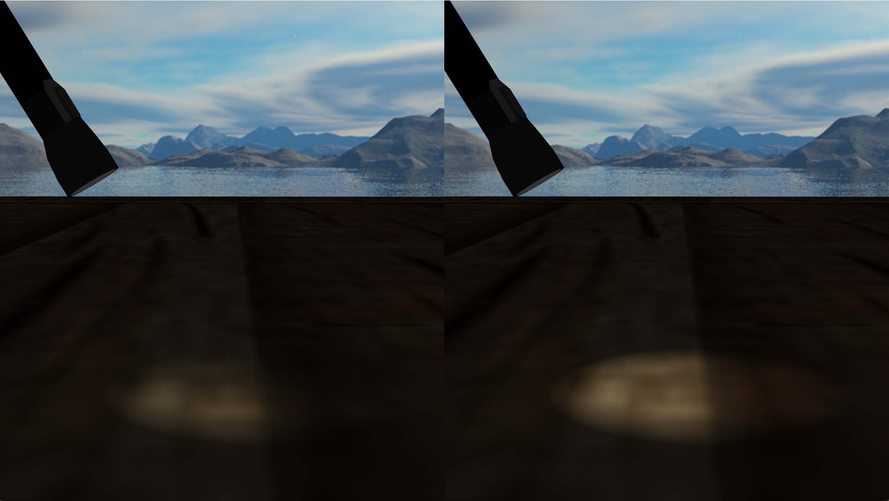

Phong 光照模型计算高光/镜面光（Specular）部分时，使用的是视线和反射光的夹角，当夹角大于 90 度时，`max(dot(reflect_light,view), 0)` 就会得出高光光照为 0：


这在一般情况下是正确的，但是如果材质的光泽度/高光指数（shininess）较低（也就是材质会反射高光，但是高光光斑很大、很散、柔和，漫反射感强，比如磨砂类材质），那么在视觉效果上，即便视线与反射光夹角大于 90 度，也应该能看到高光才对，而 Phong 光照模型会直接粗暴的将这些高光完全丢弃。

为了解决这种情况下的高光问题，1977 年 James F. Blinn 对 Phong 光照模型进行了改进，改进后的光照模型叫 *Blinn-Phong Shading Model*，也是 OpenGL 固定管线时期的内置光照模型。Blinn-Phong 光照模型最大的改变就是高光的计算方式，它不再是根据视线与反射光的夹角，而是根据半角向量（*halfway vector*，视线与光线的夹角的角平分线）与法线的夹角进行计算：


> 注意：Blinn‑Phong**不是完全不会截断高光**，当半角和法线夹角 > 90°，依然会被 `max(...,0)` 置零，只是触发截断的条件比 Phong 宽松很多。

> 当年硬件没有反射向量计算，计算反射向量需要较多运算；半角只需要向量相加 + 归一化，**计算开销更低**，这也是 OpenGL 固定管线选择 Blinn‑Phong 的重要原因，不只是效果更好。

获取半角向量非常简单，视线向量加光线向量，然后单位化：

```glsl
vec3 lightDir   = normalize(lightPos - FragPos);
vec3 viewDir    = normalize(viewPos - FragPos);
vec3 halfwayDir = normalize(lightDir + viewDir);
```

然后将高光系数计算所用的底数改为半角向量与法线的点积：

```cpp
float spec = pow(max(dot(normal, halfwayDir), 0.0), shininess);
vec3 specular = lightColor * spec;
```

Phong 光照模型与 Blinn-Phong 光照模型，在 shininess 为 1 时的对比（左侧为 Phong 模型）：



**注意，要使 Blinn-Phong 在视觉上与 Phong 相似，一般需要材质使用更大的 shininess 值。**实践经验：Blinn‑Phong 的高光指数一般要取 Phong 的约 4 倍，才能得到相近高光光斑大小。