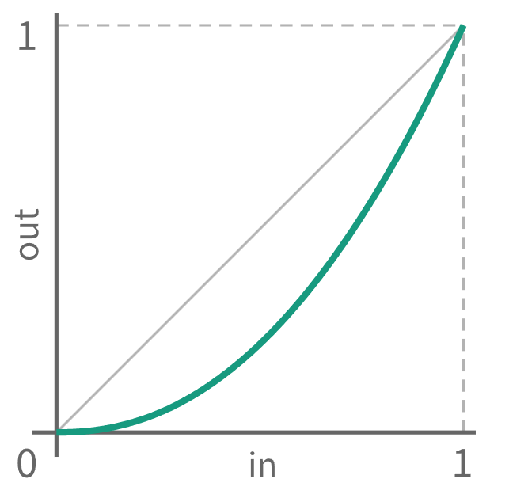
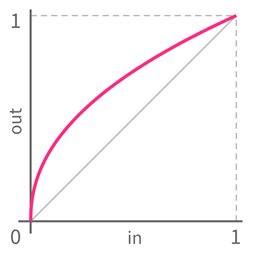
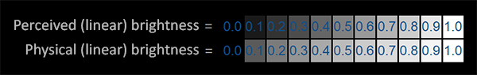
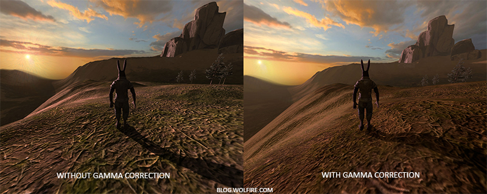

# 伽马校正的历史

CRT 显示器的显示亮度（Luminance）和其输入信号/电压（Voltage）并非线性关系，而是幂律关系：

$$
L \propto V ^ \gamma
$$

其中指数伽马 $\gamma$ 大约为 2.2。由于 CRT 的这个特性，图像的中低亮度区域会变得更暗：

为了抵消/补偿 CRT 显示器的非线性响应，人们引入了伽马校正（*Gamma Correction*），也就是将线性的光强数据按照 CRT 响应曲线的逆函数进行映射，即进行伽马编码（*Gamma Encoding / Gamma Compression*），然后再存储、传输：

$$
V = L_0^{1/\gamma}
$$

经过伽马校正后的输入，再交给 CRT 显示器显示时，就能还原回线性的光强：

$$
V ^ \gamma \rightarrow (L_0^{1/\gamma}) ^ \gamma \rightarrow L_0
$$

因此，图像文件内存储的像素值，实际上都是经过伽马编码后的值。因为 CRT 显示器的历史悠久，所以即便现在的 LCD 显示器已经可以做到线性响应，没有了 CRT 显示器的响应缺陷，也不得不为了适应大量已经存在的图像、程序而主动引入伽马解码（*Gamma Decoding/Gamma Expansion*），也就是主动实现 $L \propto V^\gamma$ 的响应曲线。

显示器默认存在的伽马编码，以及大量历史图像数据，又迫使新的图像（拍照、绘制等来源）也不得不主动完成伽马编码。实际上，“伽马校正”已经是 sRGB 标准的要求，也就是说 JPG、PNG 图像中的颜色值通常都是已经伽马编码过的值。

> sRGB 标准并不是直接按照 $\frac{1}{2.2}$ 次幂定义的伽马校正，而是一个分段函数，目的是使用更合理的（更适合人眼感知）的编码。显示器实际上也是按 sRGB 标准进行解码。

# 伽马校正与人眼感知的关联

Gamma 编码最初是为了补偿 CRT 的非线性响应，但这种非线性编码同时具有提高感知和编码效率的效果，因此后来被图像系统广泛采用。在人眼的视觉范围内，人眼对相对光强变化更敏感，因此在暗部，相同的绝对光强变化通常会带来更明显的主观亮度变化。也就是说，**人眼对暗部的相对光强变化更敏感，对亮部的相同绝对光强变化不那么敏感**。

上图中，下面的一行色块的亮度是物理上线性递增的，但是人的视觉上会觉得其暗部变化“太快”，而上面的一行色块，其亮度是按 2.2 次幂递增的，但是人的视觉上反而觉得其亮度变化更加均匀、线性。

而伽马校正/伽马编码的做法（将线性的原始数据按 $\frac{1}{2.2}$ 次幂映射），恰好能让更多的码值、台阶分配给图像的暗部。以 8 位数据为例，假设原始数据归一化到 $[0,1]$ 范围，则原始数据的 $[0,0.5]$ 会占用 8 位编码的 $[0, 186]$，相当于全部码值的 $73\%$ 都用在了原始数据中更暗的一半；而 8 位编码的 $[0, 127]$ 对应原始数据的 $[0, 0.216]$，相当于原始数据中最暗的 $21.6\%$ 部分，用掉了一半的码值。

> 注意，如果用取色器从上图中取色（读取图像文件中的编码值），会发现下面一行色块的颜色是 $\frac{1}{2.2}$ 递增的，而上面的才是线性的，这是因为图像文件已经被伽马编码过了！
> |上面一行|下面一行|
> |-|-|
> |0|0|
> |26|90|
> |51|123|
> |77|148|
> |102|169|
> |128|187|
> |153|203|
> |179|217|
> |204|231|
> |230|244|
> |255|255|

# OpenGL 中伽马校正的注意事项

因为图像和显示器存在的伽马编码和伽马解码，OpenGL 中一般需要注意两点：

1. 光照计算基于物理定律，需要线性空间的颜色值，所以从图像加载的纹理，需要完成伽马解码，以便 Shader 中使用。
2. OpenGL 的渲染结果，需要执行伽马编码（或者说伽马校正），以达到正确的显示结果。（因为显示器的伽马解码操作）

这两点的实现非常简单：

1. 加载纹理时，`internalFormat` 用 `GL_SRGB` 或 `GL_SRGB_ALPHA`，让 Shader 采样（`texture()`）时知道需要完成解码操作：
    `glTexImage2D(GL_TEXTURE_2D, 0, GL_SRGB, width, height, 0, GL_RGB, GL_UNSIGNED_BYTE, data);`
2. 使能 `GL_FRAMEBUFFER_SRGB`，让 OpenGL 在将片段着色器的输出写到 framebuffer 时，自动进行线性 RGB 到 sRGB 的非线性编码：
    `glEnable(GL_FRAMEBUFFER_SRGB);`

也可以不借助 OpenGL 的内置功能，而在 Shader 中自行完成编码、解码操作（如果需要自定义伽马值的话）。