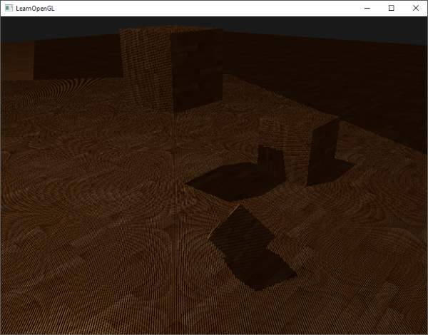
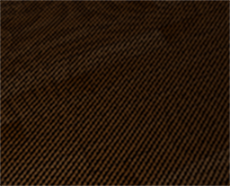
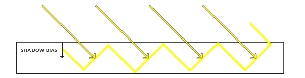
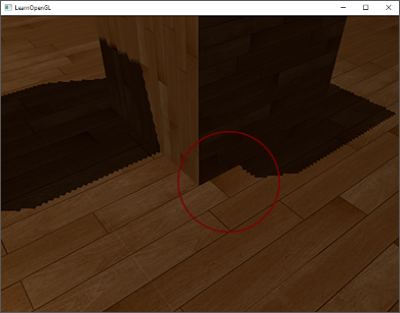
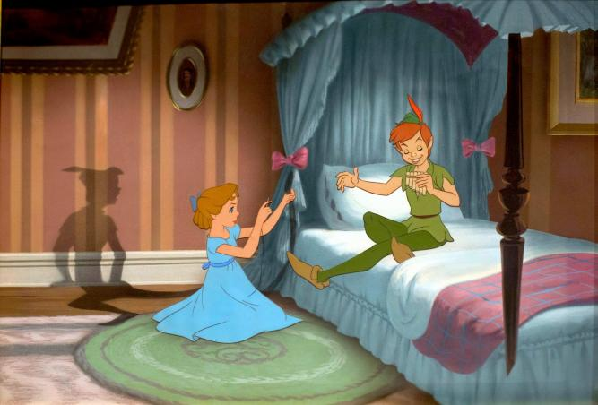
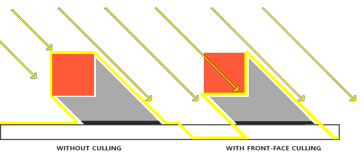
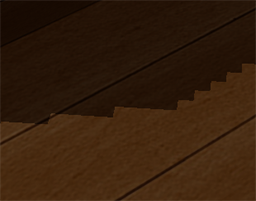
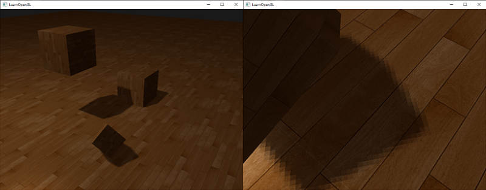

# 阴影理论基础

对于阴影的实现，目前没有一种算法能够在所有场景下都同时做到准确、高质量、高性能、稳定。实时渲染领域目前主流的做法是使用阴影贴图（*Shadow Mapping*）。要理解阴影贴图，首先要理解阴影的基本理论：

从光源发出的射线（也就是光线），首次接触的物体或片段会被点亮，而其后的物体或片段则处于阴影中。换句话说，如果从光源的视角进行渲染，那么能看到的东西将被点亮，看不见的则在阴影之中。


基于上述理论，可以看出对于一个片段，将其位置与光源位置连一条线段，若此片段是线段上距离光源最近的片段，则此片段有光照，否则此片段处于阴影下。

于是，判断片段是否处于阴影，最终被转换为判断片段在光源视角下深度值是否足够小，能使该片段不被其它片段遮挡。由此产生了使用阴影贴图实现阴影的思路：

1. 首先从光源视角进行一次渲染，得到光源视角下的最终深度缓存，将深度数据存入一个纹理，得到深度贴图（*Depth Map*）或者叫阴影贴图（*Shadow Map*）。
2. 然后将阴影贴图提供给正常渲染的 Fragment Shader，在 FS 中将当前片段 $P$ 转换为光源视角下的坐标 $P'$，并将 $P'$ 的深度值与阴影贴图中对应位置的深度值作比较，若 $P'$ 的深度值大于阴影贴图中对应位置深度值，则 $P$ 处于阴影中，反之 $P$ 被点亮。

下图是一个平行光的示例，将片段从世界空间 $P$ 转换为光源空间的 $P'$ 所用到的矩阵 $T$ 通过光源视角的投影矩阵和视图矩阵获得：$projection * view$。


# 定向光（平行光和聚光）的实现

平行光（Directional Light）和聚光（Spot Light）的特点是：

1. 有明确的方向，可以通过位置、方向、视野大小，定义出合适的 projection 和 view 矩阵，进而得到光源空间的变换矩阵
2. 阴影贴图只需要用 2D 纹理存储即可

## 光源空间的变换矩阵


对于平行光，可以假定其位置位于足够远的某处，然后通过 `glm::lookAt()` 生成 view 矩阵，projection 矩阵则通过 `glm::ortho()` 生成正交投影矩阵：

```cpp
// ortho_half_extent 表示正交视口在 X/Y 平面上的半边长，相当于光照范围的宽度的一半
inline glm::mat4 calcDirectionalLightSpaceTransform(
    glm::vec3 light_direction, float ortho_half_extent, float near_plane, float far_plane)
{
    const glm::vec3 dir = glm::normalize(light_direction);
    const glm::vec3 light_pos = -dir * (far_plane * 0.5f);
    const glm::mat4 light_view = glm::lookAt(light_pos, glm::vec3{ 0.0f }, glm::vec3{ 0.0f, 1.0f, 0.0f });
    const glm::mat4 light_projection = glm::ortho(
        -ortho_half_extent, ortho_half_extent,
        -ortho_half_extent, ortho_half_extent,
        near_plane, far_plane
    );
    return light_projection * light_view;
}
```

对于聚光，同样通过 `glm::lookAt()` 生成 view 矩阵，projection 矩阵则通过 `glm::perspective()` 生成透视投影矩阵，FOV 根据其外截止角（outer cutoff）计算：

```cpp
inline glm::mat4 calcSpotLightSpaceTransform(
    glm::vec3 pos, glm::vec3 direction, float outer_cutoff, float near_plane, float far_plane)
{
    const glm::mat4 light_projection = glm::perspective(glm::acos(outer_cutoff) * 2.0f, 1.0f, near_plane, far_plane);
    const glm::mat4 light_view = glm::lookAt(pos, pos + direction, glm::vec3{ 0.0f, 1.0f, 0.0f });
    return light_projection * light_view;
}
```

## 阴影贴图纹理和 FrameBuffer

平行光和聚光的深度贴图，通过格式为 `GL_DEPTH_COMPONENT` 的 2D 纹理存储，将纹理附加到 FrameBuffer 对象，然后使用该 FrameBuffer 对象进行渲染，来获得光源的深度贴图：

```cpp
// 1. 生成 GL_DEPTH_COMPONENT 格式的纹理
const unsigned int SHADOW_WIDTH = 1024, SHADOW_HEIGHT = 1024;
unsigned int depthMap;
glGenTextures(1, &depthMap);
glBindTexture(GL_TEXTURE_2D, depthMap);
glTexImage2D(GL_TEXTURE_2D, 0, GL_DEPTH_COMPONENT, SHADOW_WIDTH, SHADOW_HEIGHT, 0, GL_DEPTH_COMPONENT, GL_FLOAT, NULL);
glTexParameteri(GL_TEXTURE_2D, GL_TEXTURE_MIN_FILTER, GL_NEAREST);
glTexParameteri(GL_TEXTURE_2D, GL_TEXTURE_MAG_FILTER, GL_NEAREST);
// ！！！ Wrap Mode 必须设为 GL_CLAMP_TO_BORDER 并设置 border 值
glTexParameteri(GL_TEXTURE_2D, GL_TEXTURE_WRAP_S, GL_CLAMP_TO_BORDER);
glTexParameteri(GL_TEXTURE_2D, GL_TEXTURE_WRAP_T, GL_CLAMP_TO_BORDER);
float borderColor[] = { 1.0, 1.0, 1.0, 1.0 };
glTexParameterfv(GL_TEXTURE_2D, GL_TEXTURE_BORDER_COLOR, borderColor);

// 2. 生成 FBO
unsigned int depthMapFBO;
glGenFramebuffers(1, &depthMapFBO);
glBindFramebuffer(GL_FRAMEBUFFER, depthMapFBO);
glFramebufferTexture2D(GL_FRAMEBUFFER, GL_DEPTH_ATTACHMENT, GL_TEXTURE_2D, depthMap, 0);
// ！！！未提供颜色缓存的 FBO，需要设置 draw 缓存和 read 缓存为 GL_NONE
glDrawBuffer(GL_NONE);
glReadBuffer(GL_NONE);
glBindFramebuffer(GL_FRAMEBUFFER, 0);
```

创建纹理和 FrameBuffer 的注意事项：

1. 纹理的 Wrap Mode 必须设为 `GL_CLAMP_TO_BORDER`：在正常渲染 Pass 中，片段可能不在光源的“可见范围”内，此时将片段坐标变换为阴影贴图的采样坐标后，会超出范围 $[0, 1]$，比如 X 坐标可能是 1.3，此时若使用 `GL_REPEAT` 等其它 wrap mode，会导致取到错误的深度值进行比较。
2. FrameBuffer 不提供颜色缓存，因此必须 `glDrawBuffer(GL_NONE);` 和 `glReadBuffer(GL_NONE);`，注意这两个函数调用影响的是当前绑定的 FBO。

## 阴影贴图的生成

将阴影贴图 FBO 绑定后，即可借助非常简单的 VS + FS 完成阴影贴图的生成：

```glsl
// Vertex Shader
#version 330 core
layout (location = 0) in vec3 aPos;

uniform mat4 lightSpaceMatrix;
uniform mat4 model;

void main()
{
    gl_Position = lightSpaceMatrix * model * vec4(aPos, 1.0);
}
```

```glsl
// Fragment Shader
#version 330 core

void main()
{             
    // 由于我们没有颜色缓冲并且禁止了读取和绘制缓冲，因此生成的片段不需要进行任何处理
    // OpenGL 会自动更新深度缓冲
}
```

## 阴影贴图的使用/阴影的实现

在正常渲染 Pass 中，完成阴影效果需要完成的事：

1. 通过光源空间转换矩阵，获取片段的光源视角下的 NDC 坐标 $P_{light}$
2. 将 $P_{light}$ 转换到 $[0, 1]$ 范围（因为纹理坐标范是 $[0, 1]$），得到阴影坐标 $P_{shadow}$
3. 从深度贴图中采样 $(P_{shadow}.x, P_{shadow}.y)$ 得到片段对应的最近深度值 $Depth_{cloest}$，比较 $P_{shadow}.z$ 和 $Depth_{cloest}$ 来判断片段是否处于阴影中。

三个步骤均可以在片段着色器实现，但是为了减轻片段着色器的计算压力，光源裁剪空间坐标的计算，一般放在顶点着色器进行，经插值后供片段着色器使用，需要注意的是透视除法（即除以 w 分量）仍由片段着色器完成，否则插值会出错：

```glsl
// 光源裁剪空间坐标在 Vertex Shader 计算，插值后在 Fragment Shader 执行最后的透视除法
vs_out.FragPosLightSpace = lightSpaceMatrix * vec4(vs_out.FragPos, 1.0);
```

剩余步骤可在片段着色器完成，最终得到一个 `shadow` 值（1.0 表示完全在阴影中，0.0 表示完全不在阴影中），或者 `lit` 值（与 `shadow` 相反含义）：

```glsl
float ShadowCalculation(vec4 fragPosLightSpace)
{
    // 执行透视除法
    vec3 projCoords = fragPosLightSpace.xyz / fragPosLightSpace.w;
    // 变换到[0,1]的范围
    projCoords = projCoords * 0.5 + 0.5;
    // 取得最近点的深度(使用[0,1]范围下的fragPosLight当坐标)
    float closestDepth = texture(shadowMap, projCoords.xy).r; 
    // 取得当前片段在光源视角下的深度
    float currentDepth = projCoords.z;
    // 检查当前片段是否在阴影中
    float shadow = currentDepth > closestDepth  ? 1.0 : 0.0;

    return shadow;
}
```

然后将得到的 `shadow` 或 `lit` 添加到最终片段颜色的乘法中，即可实现阴影效果：

```glsl
float shadow = ShadowCalculation(fs_in.FragPosLightSpace);
// diffuse 和 specular 受阴影影响，ambient 不受影响
vec3 lighting = ambient + (1.0 - shadow) * (diffuse + specular);
FragColor = vec4(lighting, 1.0);
```



# 阴影效果的问题与改进
## 阴影失真（Shadow Acne）

如果直接采用上述方法实现阴影，会发现物体表面有非常明显的类似摩尔纹的现象，这种现象叫 *Shadow Acne*，中文一般直接叫阴影失真：



出现这种现象是因为很多不在阴影内的片段，被错误地判断为在阴影内了，也就是在进行深度比较时，发现它们的深度值大于阴影贴图中采样位置的深度值。之所以会出现深度比较错误，是因为阴影贴图的分辨率有限，当片段距离光源较远时，多个相邻的片段可能会从阴影贴图中采样到相同的值，尽管这些片段理应有同样的阴影结果，但这些片段在光源空间下的深度值是不同的，会导致它们得到不同的阴影结果。比如 4 个片段都采样深度贴图中同一个纹素，纹素深度值为 0.5，但这 4 个片段变换到光源空间后最终的深度值分别是 0.4、0.45、0.5、0.55，这就会导致深度值为 0.55 的片段被视为处于阴影中：


上图表示的是一个被倾斜光照射的平面，倾斜黄线表示阴影贴图中的同一个纹素，也表示着纹素的深度。因为阴影贴图分辨率不足，水平的黄线和粗黑线表示的片段，对应了同一个阴影贴图纹素，但是两者的深度不同（因为光线和平面非垂直），一个小于纹素深度、被点亮、标为黄色，一个大于纹素深度、未被点亮、标为黑色。最终呈现的就是类似摩尔纹的 Shadow Acne。Shadow Acene 在平面相对于光线方向越倾斜（越接近平行于光线）时，越容易出现。

为了解决 Shadow Acne，需要引入一个小技巧： *Shadow Bias*，就是将采样得到的深度值，加上一点偏移值后，也就是让阴影贴图中记录的深度值“变大一点”后，再与片段比较。也可以说将片段的深度值，减去一点偏移值，令深度值“变小一点”，再与采样值比较：



代码实现：

```glsl
float bias = 0.005;
float shadow = currentDepth - bias > closestDepth  ? 1.0 : 0.0;
```

bias 数值的选取和平面与光线的夹角关系很大，所以可以借助法线和光线向量的点积来让 bias 在一定范围内动态变化，范围则需要根据实际场景进行调试，尽可能使 bias 小一点：

```glsl
float bias = max(0.05 * (1.0 - dot(normal, lightDir)), 0.005);
```

## 阴影偏移（Peter Panning）

使用偏移量解决阴影失真，会导致阴影脱离其本应在的位置，bias 越大偏移越严重：



此现象被称作 Peter Panning，源自动画彼得潘，部分情节中彼得潘的影子脱离了他：



为了解决阴影偏移，需要使用尽可能小的 bias，或者结合另一种方法来解决 Shadow Acne 问题：*生成阴影贴图时，剔除正面、使用背面*：

```glsl
glCullFace(GL_FRONT);
RenderSceneToDepthMap();
glCullFace(GL_BACK); // 阴影贴图生成完毕后记得切回背面剔除
```

这种做法对于有“厚度”的物体比较有效果，其本质上是另一种形式的 bias，相当于将阴影贴图中的深度值加大了（使用背面的深度值），但不影响对比结果：



## 过采样（Over Sampling）/采样出界

光源的投影矩阵定义了光源的照亮范围，并非所有物体都会落在此范围内，对于不在照亮范围内的片段，该如何识别及处理就成了一个问题，也就是过采样（*Over Sampling*）。

对于不在光源空间视椎体（Frustum）内的片段，其阴影坐标会超出 $[0, 1]$ 范围，我们可以通过设置纹理的 wrap mode 为 `GL_CLAMP_TO_BORDER` 并提供 border color 来使其采样值为指定值：

```glsl
glTexParameteri(GL_TEXTURE_2D, GL_TEXTURE_WRAP_S, GL_CLAMP_TO_BORDER);
glTexParameteri(GL_TEXTURE_2D, GL_TEXTURE_WRAP_T, GL_CLAMP_TO_BORDER);
// borderColor 的 R 分量会被作为越界采样的深度值，1 表示我们希望范围外的片段默认被点亮，0 则表示我们希望范围外的片段默认处于阴影中
float borderColor[] = { 1.0f, 1.0f, 1.0f, 1.0f };
glTexParameterfv(GL_TEXTURE_2D, GL_TEXTURE_BORDER_COLOR, borderColor);
```

而对于深度值，或者说 Z 坐标超出范围的片段，则需要我们在计算阴影时，主动判断片段的 Z 分量并确定行为（越界是视为点亮还是视为阴影）：

```glsl
float ShadowCalculation(vec4 fragPosLightSpace)
{
    // [...]
    if(projCoords.z > 1.0) // Z 超范围
        shadow = 0.0;
    return shadow;
}
```

## 阴影边缘锯齿

受限于阴影贴图的分辨率，一个纹素可能覆盖了多个片段，结果就是多个片段会从深度贴图中采样相同的深度值，并得到相同的阴影判定结果，这也就导致了阴影的锯齿边缘：



增加阴影贴图的分辨率、尽可能让光的视锥体贴合场景都可以减轻阴影锯齿，除此之外，还有阴影锯齿的抗锯齿算法：百分比渐进滤波（*percentage-closer filtering，PCF*）。PCF 通过对阴影贴图周围多个纹素分别进行深度比较，再将得到的 0/1 结果取平均，从而得到平滑的阴影边缘：

```glsl
float shadow = 0.0;
vec2 texelSize = 1.0 / textureSize(shadowMap, 0);
for(int x = -1; x <= 1; ++x)
{
    for(int y = -1; y <= 1; ++y)
    {
        float pcfDepth = texture(shadowMap, projCoords.xy + vec2(x, y) * texelSize).r; 
        shadow += currentDepth - bias > pcfDepth ? 1.0 : 0.0;        
    }    
}
shadow /= 9.0;
```

可以通过修改采样数量、调整 `texelSize` 来改变柔化效果：



# 点光的阴影

点光和平行光、聚光的最大区别就是它是一个万向光（Omnidirectional Light），它在任何方向都可以生成阴影，所以普通的 2D 阴影贴图无法满足点光的阴影计算：


我们可以借助立方体贴图（Cubmap Texture）来实现点光阴影，这种技术也叫万象阴影贴图（Omnidirectional Shadow Map）。

## 阴影贴图的生成

首先需要创建 Cubemap：

```cpp
GLuint depthCubemap;
glGenTextures(1, &depthCubemap);

const GLuint SHADOW_WIDTH = 1024, SHADOW_HEIGHT = 1024;
glBindTexture(GL_TEXTURE_CUBE_MAP, depthCubemap);
for (GLuint i = 0; i < 6; ++i) {
    glTexImage2D(GL_TEXTURE_CUBE_MAP_POSITIVE_X + i, 0, GL_DEPTH_COMPONENT,  SHADOW_WIDTH, SHADOW_HEIGHT, 0, GL_DEPTH_COMPONENT, GL_FLOAT, NULL);
}

glTexParameteri(GL_TEXTURE_CUBE_MAP, GL_TEXTURE_MAG_FILTER, GL_NEAREST);
glTexParameteri(GL_TEXTURE_CUBE_MAP, GL_TEXTURE_MIN_FILTER, GL_NEAREST);
glTexParameteri(GL_TEXTURE_CUBE_MAP, GL_TEXTURE_WRAP_S, GL_CLAMP_TO_EDGE);
glTexParameteri(GL_TEXTURE_CUBE_MAP, GL_TEXTURE_WRAP_T, GL_CLAMP_TO_EDGE);
glTexParameteri(GL_TEXTURE_CUBE_MAP, GL_TEXTURE_WRAP_R, GL_CLAMP_TO_EDGE);

glBindFramebuffer(GL_FRAMEBUFFER, depthMapFBO);
glFramebufferTexture(GL_FRAMEBUFFER, GL_DEPTH_ATTACHMENT, depthCubemap, 0);
glDrawBuffer(GL_NONE);
glReadBuffer(GL_NONE);
glBindFramebuffer(GL_FRAMEBUFFER, 0);
```

注意在没有提供颜色缓存的情况下，需要通过 `glDrawBuffer(GL_NONE);` 和 `glReadBuffer(GL_NONE);` 禁用 FBO 颜色缓存的读写。

生成点光所需的 Cubemap 阴影贴图，最直接的方法就是六个方向各渲染一次，每次的结果存入 Cubemap 的一个面：

```cpp
for(int i = 0; i < 6; i++) {
    GLuint face = GL_TEXTURE_CUBE_MAP_POSITIVE_X + i;
    glFramebufferTexture2D(GL_FRAMEBUFFER, GL_DEPTH_ATTACHMENT, face, depthCubemap, 0);
    BindViewMatrix(lightViewMatrices[i]);
    RenderScene();
}
```

每个面的 view 变换如下，注意 up 向量是根据 OpenGL 规范要求的：

```cpp
std::vector<glm::mat4> lightViewMatrices{
    glm::lookAt(lightPos, lightPos + glm::vec3(1.0,0.0,0.0), glm::vec3(0.0,-1.0,0.0)),
    glm::lookAt(lightPos, lightPos + glm::vec3(-1.0,0.0,0.0), glm::vec3(0.0,-1.0,0.0)),
    glm::lookAt(lightPos, lightPos + glm::vec3(0.0,1.0,0.0), glm::vec3(0.0,0.0,1.0)),
    glm::lookAt(lightPos, lightPos + glm::vec3(0.0,-1.0,0.0), glm::vec3(0.0,0.0,-1.0)),
    glm::lookAt(lightPos, lightPos + glm::vec3(0.0,0.0,1.0), glm::vec3(0.0,-1.0,0.0)),
    glm::lookAt(lightPos, lightPos + glm::vec3(0.0,0.0,-1.0), glm::vec3(0.0,-1.0,0.0))
};
```

除了六个方向各渲染一次，还有一个方法是借助 `gl_Layer` 内置变量和 Geometry Shader，实现一次渲染 Pass 完成 Cubemap 每个面的绘制。`gl_Layer` 用于指定当前顶点/图元的输出应该写入分层帧缓冲（layered framebuffer）的哪一层，对于 Cubemap 附着的 FrameBuffer，其分为 6 层，从 0 到 5 分别对应 +X、-X、+Y、-Y、+Z、-Z。

> OpenGL 3.3 仅允许 Geometry Shader 中使用 `gl_Layer`，但是 OpenGL 4.1 开始 Vertex Shader 也可以使用此变量

首先我们在 VS 中将顶点转换到世界空间：

```glsl
#version 330 core
layout (location = 0) in vec3 position;

uniform mat4 model;

void main()
{
    gl_Position = model * vec4(position, 1.0);
}
```

然后我们在 GS 中，通过修改 `gl_Layer`，将顶点变换后提交给 6 层，即 Cubemap 的六个面：

```glsl
#version 330 core
layout (triangles) in;
layout (triangle_strip, max_vertices=18) out;

uniform mat4 shadowMatrices[6];

out vec4 FragPos; // FragPos from GS (output per emitvertex)

void main()
{
    for(int face = 0; face < 6; ++face) {
        gl_Layer = face;
        for(int i = 0; i < 3; ++i) { // for each triangle's vertices
            FragPos = gl_in[i].gl_Position;
            gl_Position = shadowMatrices[face] * FragPos;
            EmitVertex();
        }    
        EndPrimitive();
    }
}
```

GS 中使用的 `shadowMatrices[6]` 即每个面的 projection * view，注意 projection 的 FOV 是 90 度：

```cpp
GLfloat aspect = (GLfloat)SHADOW_WIDTH/(GLfloat)SHADOW_HEIGHT;
GLfloat near = 1.0f;
GLfloat far = 25.0f;
glm::mat4 shadowProj = glm::perspective(glm::radians(90.0f), aspect, near, far);

std::vector<glm::mat4> shadowMatrices;
shadowMatrices.push_back(shadowProj * lightViewMatrices[0]);
shadowMatrices.push_back(shadowProj * lightViewMatrices[1]);
shadowMatrices.push_back(shadowProj * lightViewMatrices[2]);
shadowMatrices.push_back(shadowProj * lightViewMatrices[3]);
shadowMatrices.push_back(shadowProj * lightViewMatrices[4]);
shadowMatrices.push_back(shadowProj * lightViewMatrices[5]);
```

最后，在 FS 中，我们不再使用 OpenGL 默认的深度结果，而是将片段与光源的距离值线性映射到 $[0,1]$ 后（因为 `GL_DEPTH_COMPONENT` 要求值在 $[0, 1]$），写入 `gl_FragDepth` 作为深度结果。这样做是为了方便点光阴影贴图的使用，当判断片段是否处于阴影时，可以直接通过片段与光源距离来计算：

```glsl
#version 330 core
in vec4 FragPos;

uniform vec3 lightPos;
uniform float far_plane;

void main()
{
    // 片段到光源的距离
    float lightDistance = length(FragPos.xyz - lightPos);

    // 除以 far_plane，映射到 [0, 1]
    lightDistance = lightDistance / far_plane;

    // 写入自定义深度
    gl_FragDepth = lightDistance;
}
```

## 阴影贴图的使用

点光的阴影贴图，需要用 `samplerCube` 进行采样，将光源到片段的向量作为采样坐标，并将采样得到的深度值乘以 far_plane 还原为距离值，然后比较当前片段到光源的距离：

```glsl
float ShadowCalculation(vec3 fragPos)
{
    // 计算光源到片段的向量
    vec3 lightToFrag = fragPos - lightPos;
    // 用该向量采样深度 cubemap
    float closestDepth = texture(depthMap, lightToFrag).r;
    // 贴图里是 [0, 1] 的线性深度，乘 far_plane 还原
    closestDepth *= far_plane;
    // 当前片段到光源的距离
    float currentDepth = length(lightToFrag);
    // 深度比较，判断是否在阴影中
    float bias = 0.05; 
    float shadow = currentDepth -  bias > closestDepth ? 1.0 : 0.0;

    return shadow;
}
```

## 阴影边缘锯齿

因为点光阴影是立方体贴图，所以抗锯齿的 PCF 算法不能直接套用 2D 纹理的做法，我们需要扩展为 3D 的做法，对片段位置周围的多个点位进行采样：

```glsl
float shadow  = 0.0;
float bias    = 0.05; 
float samples = 4.0;
float offset  = 0.1;
float offset_step = (offset * 2.0) / samples;
for(float x = -offset; x < offset; x += offset_step)
{
    for(float y = -offset; y < offset; y += offset_step)
    {
        for(float z = -offset; z < offset; z += offset_step)
        {
            float closestDepth = texture(depthMap, lightToFrag + vec3(x, y, z)).r; 
            closestDepth *= far_plane;   // undo mapping [0;1]
            if(currentDepth - bias > closestDepth)
                shadow += 1.0;
        }
    }
}
shadow /= (samples * samples * samples);
```

但是这种做法性能代价很大，当 `samples` 为 4 时，总采样数达到了 64。实际上这些采样点存在冗余，其中一些采样方向与原始方向向量非常接近，而沿原始方向向量的垂直方向进行偏移后采样更为合理。如果我们能去掉冗余的采样，就可以减少采样次数。然而，确定哪些子方向存在冗余并不容易，所以我们可以采用的一个技巧是使用一个偏移方向数组，其中所有方向互不重叠，例如每个方向都指向完全不同的方向，来减少最终相邻的子方向数量。下面是一个包含 20 个偏移方向的数组，这些坐标是一个立方体的 8 个顶角和 12 条边的中点：

```glsl
vec3 sampleOffsetDirections[20] = vec3[]
(
   vec3( 1,  1,  1), vec3( 1, -1,  1), vec3(-1, -1,  1), vec3(-1,  1,  1), 
   vec3( 1,  1, -1), vec3( 1, -1, -1), vec3(-1, -1, -1), vec3(-1,  1, -1),
   vec3( 1,  1,  0), vec3( 1, -1,  0), vec3(-1, -1,  0), vec3(-1,  1,  0),
   vec3( 1,  0,  1), vec3(-1,  0,  1), vec3( 1,  0, -1), vec3(-1,  0, -1),
   vec3( 0,  1,  1), vec3( 0, -1,  1), vec3( 0, -1, -1), vec3( 0,  1, -1)
);
```

由此，我们可以对 PCF 算法进行调整，从偏移方向数组确定固定数量的采样点，并利用这些采样点对立方体贴图进行采样，这样我们只需极少的样本量就能获得视觉上相似的结果：

```glsl
float shadow = 0.0;
float bias   = 0.15;
float viewDistance = length(viewPos - fragPos);
float diskRadius = 0.05;
for(int i = 0; i < 20; ++i)
{
    float closestDepth = texture(depthMap, lightToFrag + sampleOffsetDirections[i] * diskRadius).r;
    closestDepth *= far_plane;   // undo mapping [0;1]
    if(currentDepth - bias > closestDepth)
        shadow += 1.0;
}
shadow /= float(20);
```
