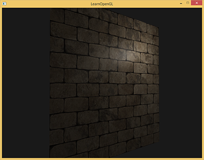
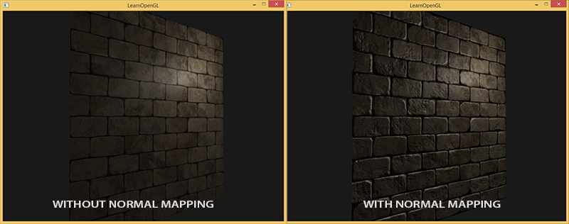
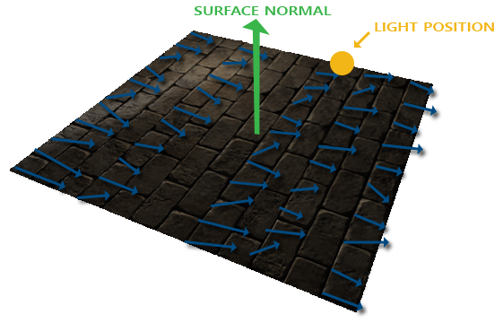

# 法线贴图原理

纹理可以为平面赋予丰富的表面细节，但是对于凹凸不平的表面（比如砖块），在靠近观察或特定光照下，依然不够真实，因为表面看起来依然是“平坦”的：



我们可以直接增加网格细分来表现这些细节，但会带来大量额外的顶点和三角形，增加渲染开销。所以我们转而思考是什么使表面被视为完全平坦的？答案是表面的法线向量。从光照的视角来看，决定物体“形状”的就是垂直于它的法线向量。上图中的墙看起来是平坦的，就是因为所有片段都是一样的法线向量，由顶点法线插值得到，而顶点法线又都是一样的。如果每个片段都能有自己的不同的法线，就可以产生凹凸不平的视觉幻觉：


像 diffuse 贴图和 specular 贴图一样，我们可以使用一个 2D 纹理来储存法线数据，为平面的每个片段提供不同的法线。这种技术叫做法线贴图（*normal mapping*）或凹凸贴图（*bump mapping*），其应用效果如下：



图片存储的是颜色信息，虽然可以让颜色分量的 r、g、b 代表一个 3D 向量，但是法线向量的分量理论上范围是 $[-1, 1]$，而颜色值范围是 $[0, 1]$，所以将法线向量存入图片时，需要进行线性映射：

```glsl
vec3 rgb_normal = normal * 0.5 + 0.5; // 从 [-1,1] 转换至 [0,1]
```

从图片中读取/还原法线向量时，要做 $[0, 1]$ 到 $[-1, 1]$ 的映射：

```glsl
uniform sampler2D normalMap;  

void main()
{
    // 从法线贴图范围[0,1]获取法线
    normal = texture(normalMap, fs_in.TexCoords).rgb;
    // 将法线向量转换为范围[-1,1]
    normal = normalize(normal * 2.0 - 1.0);   

    [...]
    // 像往常那样处理光照
}
```

一张保存了法线向量的法线贴图，用图片查看软件查看时，往往整体呈蓝色色调，因为绝大多数法线还是贴近 Z 轴的，也就是 $(0, 0, 1)$：


# 切线空间

如果从法线贴图获取法线后直接使用，在平面进行旋转后，光照效果就会出错，因为法线贴图中读取的向量是“静态”的，不论当前平面被旋转至什么角度，片段读取到的法线总是一样的，这就会导致用于光照计算的法线向量其实不垂直于片段：



为了正确使用法线向量，我们需要：

1. 确定法线贴图中的法线向量定义于什么空间
2. 实现一个变换矩阵，将法线贴图中的法线从其定义空间变换到光照计算所在的空间（一般是世界空间）

法线贴图中的法线向量定义于切线空间（*Tangent Space*），切线空间是与三角形表面相关的局部空间，在这个空间中，表面的法线 N （*Normal*）是指向正 Z 的单位向量 $(0, 0, 1)$。而切线 T（*Tangent*）是沿纹理 U 坐标增长方向的单位向量 $(1, 0, 0)$，副切线 B（*Bitangent*）是沿纹理 V 坐标增长方向的单位向量 $(0, 1, 0)$。这三个单位向量互相垂直，切线空间就是以 T、B、N 为三个坐标轴建立的局部坐标系。


如果我们能知道 T、B、N 在另一个坐标系下的表示，那我们就能用这三个向量定一个 TBN 矩阵（*TBN Matrix*），用 TBN 矩阵乘以切线空间下的方向向量 V，就能得到 V 在另一个坐标系下的表示。比如世界空间下的 $T_w$、$B_w$、$N_w$，组成 TBN 矩阵 $\begin{bmatrix} | & | & | \\ T_w & B_w & N_w \\ | & | & | \end{bmatrix}$，将此矩阵乘以 V 就能得到 $V_w$。

> 注意，TBN 矩阵的基向量顺序必须与坐标分量的定义一致，由于 T 对应 X，B 对应 Y，N 对应 Z，所以列向量约定下的 TBN 矩阵是 T、B、N 三个列向量组成。

# 切线和副切线的计算原理

对于一个三角形，法线由几何形状决定，假设三角形三个顶点为 $P_1$、$P_2$、$P_3$，那么可以得到两条边：

$$
E_1 = P_2 - P_1 \\
E_2 = P_3 - P_1
$$

法线 N 就是：

$$
N = \frac{E_1 \times E_2}{\|E_1 \times E_2\|}
$$

> 模型文件中一个顶点可能同时属于多个三角形，法线作为顶点属性，往往是通过相邻三角形的面法线加权平均得到的。

而切线 T 和副切线 B 不仅取决于几何形状，还取决于 UV 如何映射到表面，也就是由几何形状 + UV 共同决定。我们需要知道三角形顶点对应的 UV 坐标，才能计算出 T 和 B：


上图中，三角形边 $E_2$ 可以通过点 $P_2$ 和 $P_3$ 的纹理坐标差 $\Delta U_2$ 和 $\Delta V_2$，以及切线 T、副切线 B 计算得到：

$$
E_2 = \Delta U_2T + \Delta V_2B
$$

同理可得 $E_1$ 公式：

$$
E_1 = \Delta U_1T + \Delta V_1B
$$

有以上两公式，即可计算出 T 和 B，先展开：

$$
(E_{1x}, E_{1y}, E_{1z}) = \Delta U_1(T_x, T_y, T_z) + \Delta V_1(B_x, B_y, B_z) \\
(E_{2x}, E_{2y}, E_{2z}) = \Delta U_2(T_x, T_y, T_z) + \Delta V_2(B_x, B_y, B_z) \\
$$

转换为矩阵形式：

$$
\begin{bmatrix}
E_{1x} & E_{1y} & E_{1z} \\ E_{2x} & E_{2y} & E_{2z} \end{bmatrix} = \begin{bmatrix} \Delta U_1 & \Delta V_1 \\ \Delta U_2 & \Delta V_2 \end{bmatrix} \begin{bmatrix} T_x & T_y & T_z \\ B_x & B_y & B_z
\end{bmatrix}
$$

通过逆矩阵移项：

$$
\begin{bmatrix}
\Delta U_1 & \Delta V_1 \\ \Delta U_2 & \Delta V_2 \end{bmatrix}^{-1} \begin{bmatrix} E_{1x} & E_{1y} & E_{1z} \\ E_{2x} & E_{2y} & E_{2z} \end{bmatrix} = \begin{bmatrix} T_x & T_y & T_z \\ B_x & B_y & B_z
\end{bmatrix}
$$

展开逆矩阵：

$$
\begin{bmatrix}
T_x & T_y & T_z \\ B_x & B_y & B_z \end{bmatrix}  = \frac{1}{\Delta U_1 \Delta V_2 - \Delta U_2 \Delta V_1} \begin{bmatrix} \Delta V_2 & -\Delta V_1 \\ -\Delta U_2 & \Delta U_1 \end{bmatrix} \begin{bmatrix} E_{1x} & E_{1y} & E_{1z} \\ E_{2x} & E_{2y} & E_{2z}
\end{bmatrix}
$$

# 加载模型时获取切线数据和法线贴图

实际应用中，法线、切线一般都不需要自行计算，Assimp 等模型加载工具已经实现了相关计算。对于 Assimp，法线可通过 `mesh->mNormals[i]` 获取，而切线则需要在 `ReadFile()` 时加上 `aiProcess_CalcTangentSpace` 来支持自动计算：

```cpp
const aiScene *scene = importer.ReadFile(
    path, aiProcess_Triangulate | aiProcess_FlipUVs | aiProcess_CalcTangentSpace
);
```

然后通过 `mesh->mTangents[i]` 获取顶点切线：

```cpp
if (mesh->HasTangentsAndBitangents()) {
    vertex.tangent.x = mesh->mTangents[i].x;
    vertex.tangent.y = mesh->mTangents[i].y;
    vertex.tangent.z = mesh->mTangents[i].z;
}
```

> 注意，法线、切线都是顶点属性，都可以看作对顶点的相邻三角形贡献进行综合得到的结果；法线主要综合相邻面的法线，而切线则根据三角形的顶点位置和纹理坐标计算切线贡献，再进行综合。

> 副切线也可以通过 `mesh->mBitangents[i]` 访问，但是副切线一般不在 CPU 侧提供，而是在 Shader 中根据插值后的法线和切线重新计算，避免额外传递一个顶点属性，并确保构建出的 TBN 坐标系与当前片段的法线和切线保持一致。

通过类型为 `aiTextureType_NORMAL` 的纹理加载法线贴图：

```cpp
for(unsigned i = 0; i < material->GetTextureCount(aiTextureType_NORMAL); ++i) {
    aiString str;
    material->GetTexture(aiTextureType_NORMAL, i, &str);
}
```

> 对于 Wavefront OBJ 格式模型文件（.obj），法线贴图有可能属于 `aiTextureType_HEIGHT` 类型，但是 `aiTextureType_HEIGHT` 一般为高度贴图，用于视差映射（一种进一步体现表面凹凸的技术）。

# 切线与法线贴图的使用

